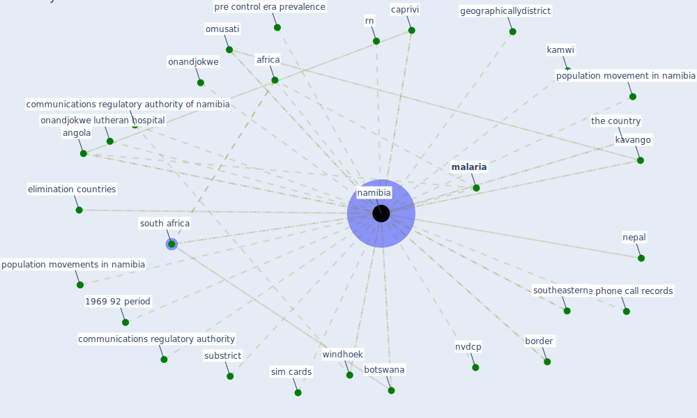

# Keyword: namibia

## Keywords

 * 1969 92 period, 9mobile telecommunications limited, [africa](keyword_africa), angola, border, botswana, caprivi, communications regulatory authority, communications regulatory authority of namibia, elimination countries, geographicallydistrict, kamwi, kavango, [malaria](keyword_malaria), malaria cases in namibia, malaria control, malaria policy, malaria programme, mobile phone call records, mobile phone network, mobile telecommunications limited, mobile telecommunications limited mtc, mtcnamibia, [namibia](keyword_namibia), nepal, northerene, northern, nvdcp, omusati, onandjokwe, onandjokwe lutheran hospital, population movement in namibia, population movements in namibia, pre control era prevalence, rn, sim cards, [south africa](keyword_south_africa), southeastern, substrict, the country, windhoek

## Mapping

## Neighbours

### Closest articles

* Integrating rapid risk mapping and mobile phone call record data for strategic malaria elimination planning - [LINK](article_tatem_integrating_2014)
* Building sustainable finance for resilient protected and conserved areas: lessons from COVID-19 - [LINK](article_cumming_building_2021)
* The impact of climate change on the epidemiology and control of Rift Valley fever - PubMed - [LINK](article_martin_impact_2008)
* Startups in times of crisis – A rapid response to the COVID-19 pandemic - [LINK](article_kuckertz_startups_2020)
* Management of the COVID-19 pandemic: challenges, practices, and organizational support - [LINK](article_hossny_management_2022)

### Closest BPs

