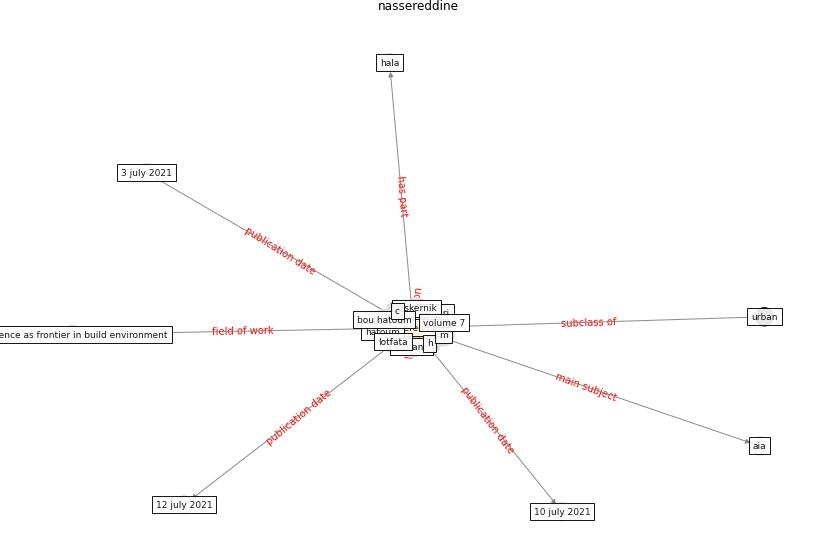

# Keyword: __nassereddine__
## Clusters

* Cluster 2: [construction-resilience](cluster_2.md)

## Concepts

 

## Articles
* Analysis of COVID-19 Concerns Raised by the
Construction Workforce and Development of
Mitigation Practices ([bou_hatoum_analysis_2021](article_bou_hatoum_analysis_2021.md))
* Analysis of COVID-19 Concerns Raised by the
Construction Workforce and Development of
Mitigation Practices ([bou_hatoum_analysis_2021](article_bou_hatoum_analysis_2021.md))
* Analysis of COVID-19 Concerns Raised by the
Construction Workforce and Development of
Mitigation Practices ([bou_hatoum_analysis_2021](article_bou_hatoum_analysis_2021.md))
* Influence between COVID-19 Impacts and Project
Stakeholders in Chilean Construction Projects ([araya_influence_2021](article_araya_influence_2021.md))
* nassereddine_propositions_2021-100 ([nassereddine_propositions_2021-100](article_nassereddine_propositions_2021-100.md))
* A Global Survey of Infection Control and
Mitigation Measures for Combating the Transmission
of COVID-19 Pandemic in Buildings Under
Facilities Management Services ([sarvari_global_2022](article_sarvari_global_2022.md))
* Analysis of COVID-19 Concerns Raised by the
Construction Workforce and Development of
Mitigation Practices ([bou_hatoum_analysis_2021](article_bou_hatoum_analysis_2021.md))
* Analysis of COVID-19 Concerns Raised by the
Construction Workforce and Development of
Mitigation Practices ([bou_hatoum_analysis_2021](article_bou_hatoum_analysis_2021.md))
* nassereddine_propositions_2021-300 ([nassereddine_propositions_2021-300](article_nassereddine_propositions_2021-300.md))
* nassereddine_propositions_2021-150 ([nassereddine_propositions_2021-150](article_nassereddine_propositions_2021-150.md))
