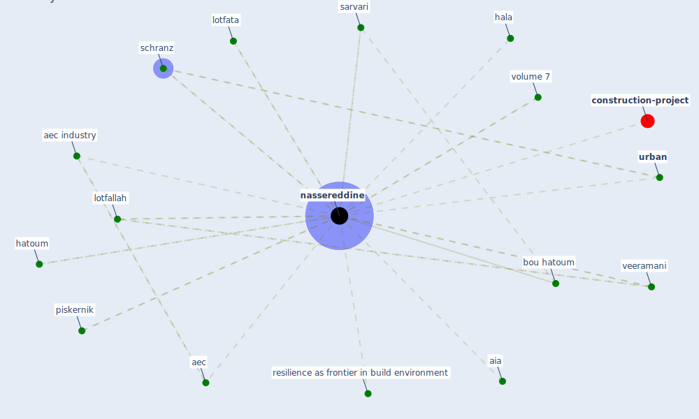

# Keyword: nassereddine

* [construction-project](cluster_8)

## Keywords

 * Cluster_8, aec, aec industry, aia, bou hatoum, hala, hatoum, lotfallah, lotfata, [nassereddine](keyword_nassereddine), piskernik, resilience as frontier in build environment, sarvari, schranz, [urban](keyword_urban), veeramani, volume 7

## Mapping

## Neighbours

### Closest articles

* Propositions for a Resilient, Post-COVID-19 Future for the AEC Industry - [LINK](article_nassereddine_propositions_2021)
* Analysis of COVID-19 Concerns Raised by the Construction Workforce and Development of Mitigation Practices - [LINK](article_bou_hatoum_analysis_2021)
* A Global Survey of Infection Control and Mitigation Measures for Combating the Transmission of COVID-19 Pandemic in Buildings Under Facilities Management Services - [LINK](article_sarvari_global_2022)
* Influence between COVID-19 Impacts and Project Stakeholders in Chilean Construction Projects - [LINK](article_araya_influence_2021)

### Closest BPs

