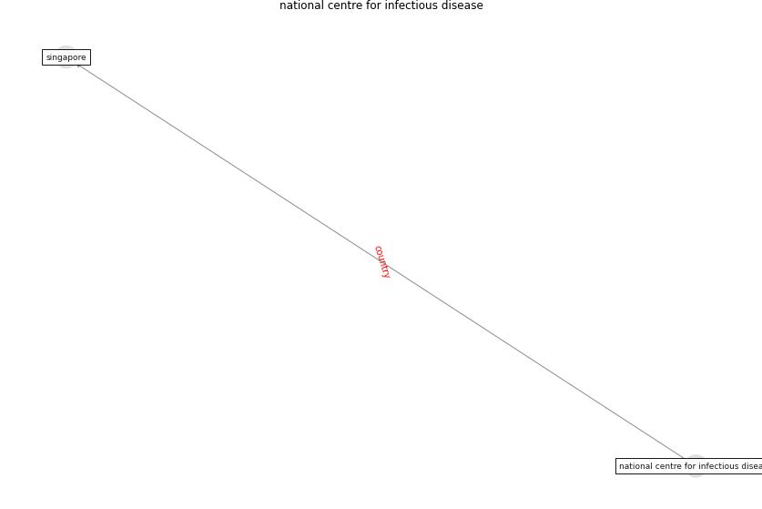

# Keyword: __national centre for infectious disease__

## Concepts

 

## Top articles for __national centre for infectious disease__
* Air, Surface Environmental, and Personal
Protective Equipment Contamination by Severe
Acute Respiratory Syndrome Coronavirus 2
(SARS-CoV-2) From a Symptomatic Patient ([ong_air_2020](article_ong_air_2020))
