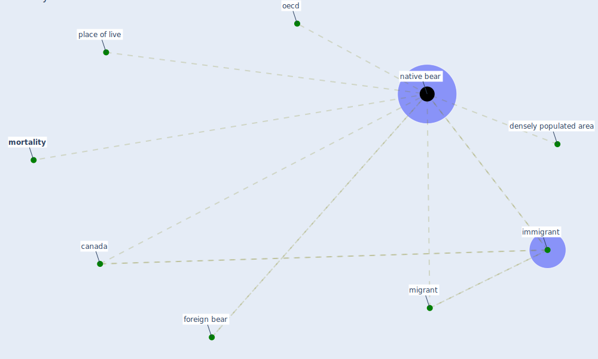

# Keyword: native bear

## Keywords

 * [canada](keyword_canada), densely populated area, [foreign bear](keyword_foreign_bear), [immigrant](keyword_immigrant), migrant, [mortality](keyword_mortality), [native bear](keyword_native_bear), native born, [oecd](keyword_oecd), place of live

## Mapping

## Neighbours

### Closest articles

* What has been the impact of the COVID-19 pandemic on immigrants? An update on recent evidence - [LINK](article_oecd_what_2022)

### Closest BPs

