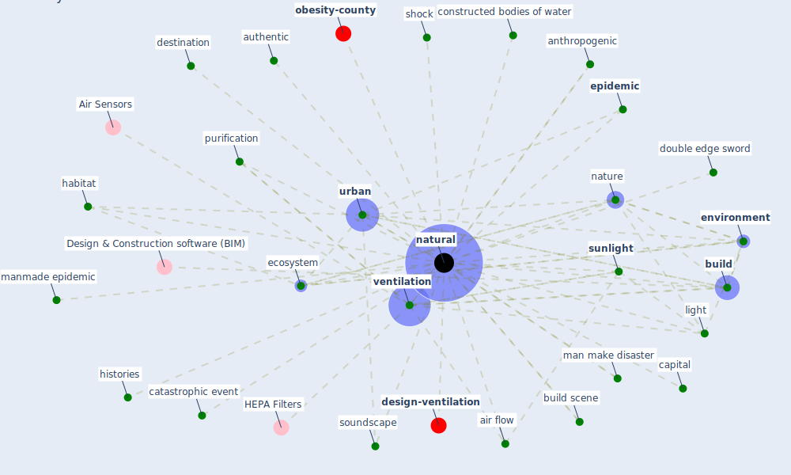

# Keyword: natural

* [design-ventilation](cluster_9)

* [obesity-county](cluster_12)

## Keywords

 * Cluster_12, Cluster_9, air flow, anthropogenic, authentic, [build](keyword_build), build scene, capital, catastrophic event, constructed bodies of water, destination, double edge sword, [ecosystem](keyword_ecosystem), [environment](keyword_environment), [epidemic](keyword_epidemic), habitat, histories, light, man make disaster, manmade epidemic, [natural](keyword_natural), [nature](keyword_nature), purification, [shock](keyword_shock), soundscape, [sunlight](keyword_sunlight), [urban](keyword_urban), [ventilation](keyword_ventilation)

## Mapping

## Neighbours

### Closest articles

* Biophilic design in architecture and its contributions to health, well-being, and sustainability: A critical review - [LINK](article_zhong_biophilic_2022)
* Guidelines for resilience systems analysis - [LINK](article_oecd_guidelines_2014)
* Health, Wellbeing \& Productivity in Offices - [LINK](article_world_green_building_council_health_2014)
* How is COVID-19 Experience Transforming Sustainability Requirements of Residential Buildings? A Review - [LINK](article_tokazhanov_how_2020)
* ASHRAE Position Document on Infectious Aerosols - [LINK](article_ashrae_ashrae_2022)
* Heating, ventilation and air-conditioning systems in the context of COVID-19 - [LINK](article_ecdc_heating_2020)
* A review of definitions and measures of system resilience - [LINK](article_hosseini_review_2016)
* How COVID-19 Could Accelerate the Adoption of New Retail Technologies and Enhance the (E-)Servicescape - [LINK](article_willems_how_2021)
* Prototype Early Warning Systems for Vector-Borne Diseases in Europe - [LINK](article_semenza_prototype_2015)
* A Global Survey of Infection Control and Mitigation Measures for Combating the Transmission of COVID-19 Pandemic in Buildings Under Facilities Management Services - [LINK](article_sarvari_global_2022)

### Closest BPs

