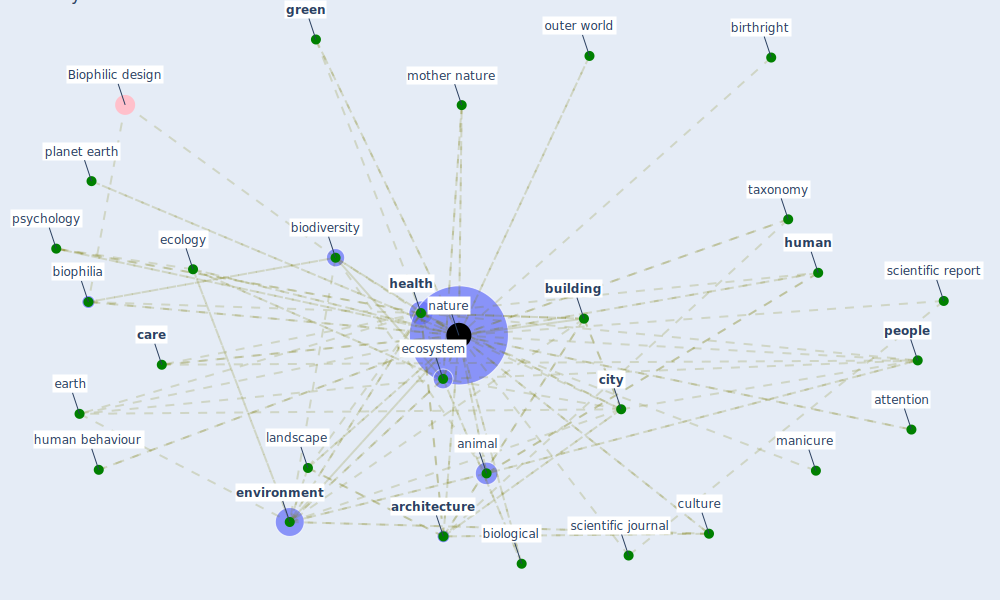

# Keyword: nature

## Keywords

 * a hajrasouliha, [air](keyword_air), amazon rainforest, animal, [architecture](keyword_architecture), attention, back to nature, behaviour, bio inspire design, [biodiversity](keyword_biodiversity), biological, biophilia, [biophilic](keyword_biophilic), birthright, [build environment](keyword_build_environment), [building](keyword_building), c j, [care](keyword_care), [city](keyword_city), culture, [design](keyword_design), earth, ecology, [economy](keyword_economy), [ecosystem](keyword_ecosystem), ecosystem service perspective, [environment](keyword_environment), [environmental](keyword_environmental), [experience](keyword_experience), fauna, finance for nature, fresh air, [garden](keyword_garden), go, go nature, [green](keyword_green), [health](keyword_health), [human](keyword_human), human behaviour, human nature, human nature connectedness, image, intangible, landscape, live organism, manicure, [microbiol](keyword_microbiol), microbiology, mother nature, [nature](keyword_nature), [naturen](keyword_naturen), naturen og f eks, nutrient, outdoor activity, outdoor environment, outdoors, outer world, p2, [people](keyword_people), planet earth, psychology, [public health](keyword_public_health), publishing group, rain garden, regenerative, rev microbiol, review drug discovery, s41586 020 2196 x, s41893 020 0519 4, scientific datum, scientific journal, scientific report, scientificdata, scientificreport, self revival, selfregeneration, sky, [solution](keyword_solution), specie, springer nature, state of nature partnership, [stress](keyword_stress), [sustainability](keyword_sustainability), [sustainable](keyword_sustainable), sustainable living, sustainable project, [switzerland](keyword_switzerland), taxonomy, the environment, [tree](keyword_tree), tree cover, [urban](keyword_urban), urban bird feeding, [urban green space](keyword_urban_green_space), view, view out, vore natur, walk the dog, woode, flora

## Mapping

## Neighbours

### Closest articles

* Biophilic design in architecture and its contributions to health, well-being, and sustainability: A critical review - [LINK](article_zhong_biophilic_2022)
* Nurture to nature via COVID-19, a self-regenerating environmental strategy of environment in global context - [LINK](article_paital_nurture_2020)
* Health, Wellbeing \& Productivity in Offices - [LINK](article_world_green_building_council_health_2014)
* How COVID-19 Could Accelerate the Adoption of New Retail Technologies and Enhance the (E-)Servicescape - [LINK](article_willems_how_2021)
* Green spaces, especially forest, linked to lower SARS-CoV-2 infection rates: A one-year nationwide study - [LINK](article_jiang_green_2021)
* Refleksioner fra en pandemi - [LINK](article_realdania_refleksioner_2022)
* Green infrastructure through the lens of “One Health”: A systematic review and integrative framework uncovering synergies and trade-offs between mental health and wildlife support in cities - [LINK](article_felappi_green_2020)
* Building sustainable finance for resilient protected and conserved areas: lessons from COVID-19 - [LINK](article_cumming_building_2021)
* Understanding the role of urban design in disease spreading - [LINK](article_brizuela_understanding_2019)
* How Architecture Fails in Conditions of Crisis: a Discussion on the Value of Interior Design over the COVID-19 Outbreak - [LINK](article_rassia_how_2020)

### Closest BPs

