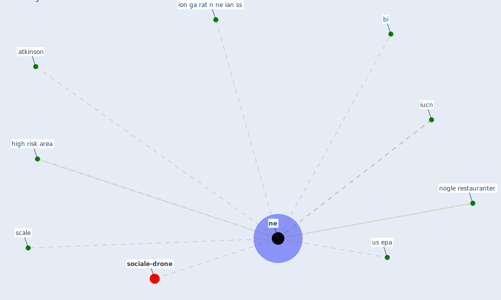

# Keyword: ne

* [sociale-drone](cluster_6)

## Keywords

 * Cluster_6, atkinson, bi, high risk area, ion ga rat n ne ian ss, iucn, [ne](keyword_ne), ned, ning, nogle restauranter, scale, us epa

## Mapping

## Neighbours

### Closest articles

* The impacts of knowledge, risk perception, emotion and information on citizens’ protective behaviors during the outbreak of COVID-19: a cross-sectional study in China - [LINK](article_ning_impacts_2020)
* The Role of Architecture and Urbanism in Preventing Pandemics - [LINK](article_kumar_role_2021)
* Addressing vulnerability, building resilience: community-based adaptation to vector-borne diseases in the context of global change - [LINK](article_bardosh_addressing_2017)
* Pandemiens arkitektur - [LINK](article_realdania_pandemiens_2022)
* Treating two pandemics for the price of one: Chronic and infectious disease impacts of the built and natural environment - [LINK](article_frank_treating_2021)
* Respiratory pandemics, urban planning and design: A multidisciplinary rapid review of the literature - [LINK](article_harris_respiratory_2022)
* World Bank Development Report - [LINK](article_world_bank_world_2022)

### Closest BPs

