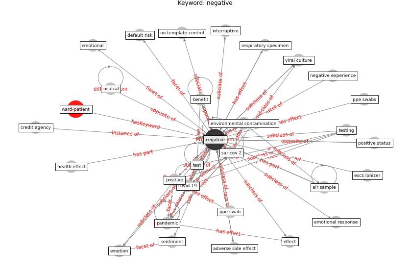

# Keyword: negative

* [ward-patient](cluster_Cluster_15)

## Keywords

 * Cluster_15, adverse side effect, air sample, all surface roadsstudy, benefit, coefficient, [control](keyword_control), [covid-19](keyword_covid-19), credit agency, default risk, emotion, [emotional](keyword_emotional), emotional response, environmental contamination, escs ionizer, effect, health effect, interruptive, [negative](keyword_negative), negative experience, neutral, no template control, [pandemic](keyword_pandemic), positive, positive status, ppe swab, ppe swabs, respiratory specimen, [sar cov 2](keyword_sar_cov_2), sentiment, test, [testing](keyword_testing), viral culture, [virus](keyword_virus)

## Concepts

 

## Neighbours

### Closest articles

* Air, Surface Environmental, and Personal Protective Equipment Contamination by Severe Acute Respiratory Syndrome Coronavirus 2 (SARS-CoV-2) From a Symptomatic Patient - [LINK](article_ong_air_2020)
* SARS-CoV-2 RNA detection of hospital isolation wards hygiene monitoring during the Coronavirus Disease 2019 outbreak in a Chinese hospital - [LINK](article_wang_sars-cov-2_2020)
* Toilets dominate environmental detection of SARS-CoV-2 virus in a hospital - [LINK](article_ding_toilets_2020)
* Health, Wellbeing \& Productivity in Offices - [LINK](article_world_green_building_council_health_2014)
* Ten questions concerning occupant health in buildings during normal operations and extreme events including the COVID-19 pandemic - [LINK](article_awada_ten_2021)
* Strategies to Mitigate COVID-19 Pandemic Impacts on Health and Safety of Workers in Construction Projects - [LINK](article_kaushal_strategies_2021)
* Sustainable work throughout the life course: National policies and strategies, Publications Office of the European Union - [LINK](article_eurofund_sustainable_2016)
* COVID-19 Lockdown: Housing Built Environment’s Effects on Mental Health - [LINK](article_amerio_covid-19_2020)
* The impacts of knowledge, risk perception, emotion and information on citizens’ protective behaviors during the outbreak of COVID-19: a cross-sectional study in China - [LINK](article_ning_impacts_2020)
* Compliance with COVID-19 Mitigation Measures in the United States - [LINK](article_van_rooij_compliance_2020)

### Closest BPs

