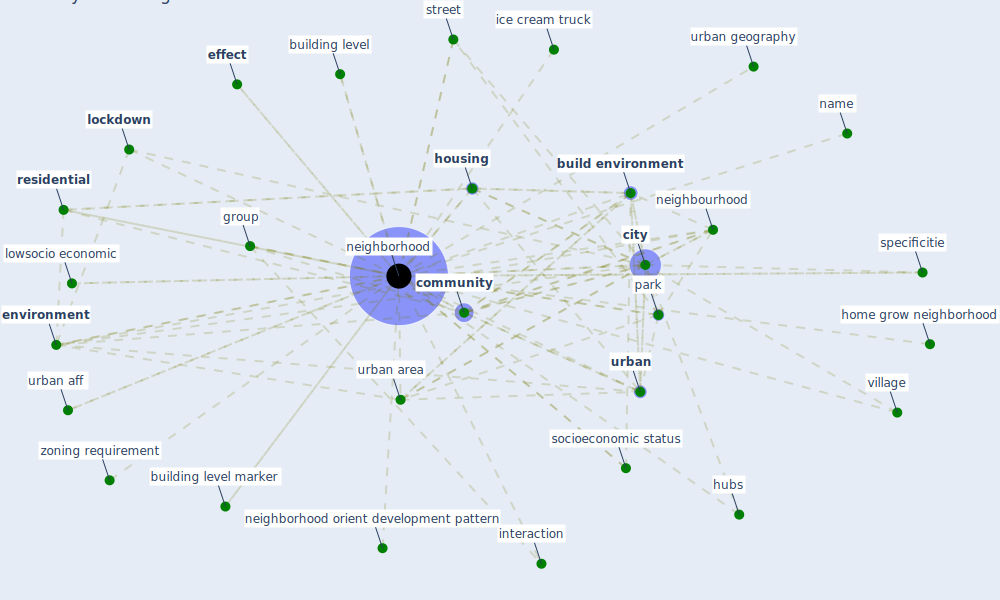

# Keyword: neighborhood

## Keywords

 * [area](keyword_area), [build environment](keyword_build_environment), building level, building level marker, census block group, [city](keyword_city), city center, city of new york, city s population, [community](keyword_community), [covid-19](keyword_covid-19), [effect](keyword_effect), [environment](keyword_environment), [epidemiological](keyword_epidemiological), [gate community](keyword_gate_community), gdl, group, home grow neighborhood, [housing](keyword_housing), hubs, ice cream truck, [interaction](keyword_interaction), [lockdown](keyword_lockdown), lowsocio economic, lowsocio economic neighborhood, medically underserve, medium density, name, [neighborhood](keyword_neighborhood), neighborhood context, neighborhood effect, neighborhood orient development, neighborhood orient development pattern, neighborhood public space, neighborhood unit, neighborhoods, neighbourhood, neo traditional, net source of mobility, [new york city](keyword_new_york_city), park, [people](keyword_people), place of residence, process, proximity economies, [public space](keyword_public_space), puerto madero, [residential](keyword_residential), self sufficient, sequester village, [social](keyword_social), socioeconomic status, specificitie, street, third places, [urban](keyword_urban), urban aff, urban area, urban geography, urban inequality, [urban planning](keyword_urban_planning), village, zone, zoning requirement

## Mapping

## Neighbours

### Closest articles

* Understanding the role of urban design in disease spreading - [LINK](article_brizuela_understanding_2019)
* Proximity and post-COVID-19 urban development: Reflections from Milan, Italy - [LINK](article_tricarico_proximity_2021)
* Impact of Covid-19 on the built environment - [LINK](article_mahima_impact_2022)
* How COVID-19 Could Accelerate the Adoption of New Retail Technologies and Enhance the (E-)Servicescape - [LINK](article_willems_how_2021)
* Treating two pandemics for the price of one: Chronic and infectious disease impacts of the built and natural environment - [LINK](article_frank_treating_2021)
* Navigating Climate Change: Rethinking the Role of Buildings - [LINK](article_cole_navigating_2020)
* The Role of Architecture and Urbanism in Preventing Pandemics - [LINK](article_kumar_role_2021)
* Ten questions concerning occupant health in buildings during normal operations and extreme events including the COVID-19 pandemic - [LINK](article_awada_ten_2021)
* COVID-19 and Green Housing: A Review of Relevant Literature - [LINK](article_kaklauskas_covid-19_2021)
* Prophylactic Architecture: Formulating the Concept of Pandemic-Resilient Homes - [LINK](article_elrayies_prophylactic_2022)

### Closest BPs

