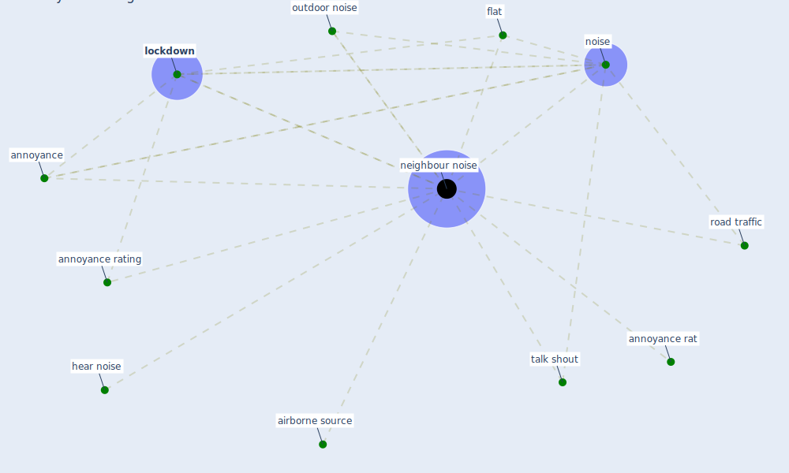

# Keyword: neighbour noise

## Keywords

 * airborne source, [annoyance](keyword_annoyance), annoyance rat, annoyance rating, flat, hear noise, [lockdown](keyword_lockdown), [neighbour noise](keyword_neighbour_noise), [noise](keyword_noise), outdoor noise, road traffic, talk shout

## Mapping

## Neighbours

### Closest articles

* Attitudes towards outdoor and neighbour noise during the COVID-19 lockdown: A case study in London - [LINK](article_lee_attitudes_2021)

### Closest BPs

