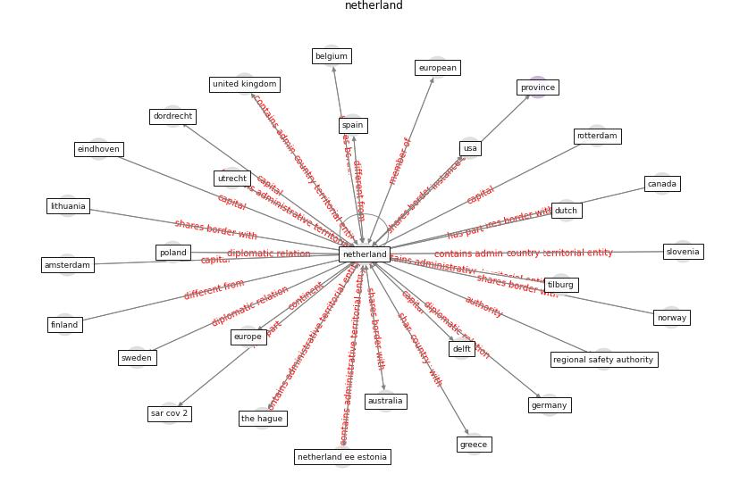

# Keyword: __netherland__

## Concepts

 

## Top articles for __netherland__
* yan_10_2020 ([yan_10_2020](article_yan_10_2020))
* A study on office workplace modification during the
COVID-19 pandemic in The Netherlands ([hou_study_2021](article_hou_study_2021))
* SARS-CoV-2 in wastewater: potential health risk, but
also data source ([lodder_sars-cov-2_2020](article_lodder_sars-cov-2_2020))
* Presence of SARS-Coronavirus-2 RNA in Sewage and
Correlation with Reported COVID-19 Prevalence in
the Early Stage of the Epidemic in The
Netherlands ([medema_presence_2020](article_medema_presence_2020))
