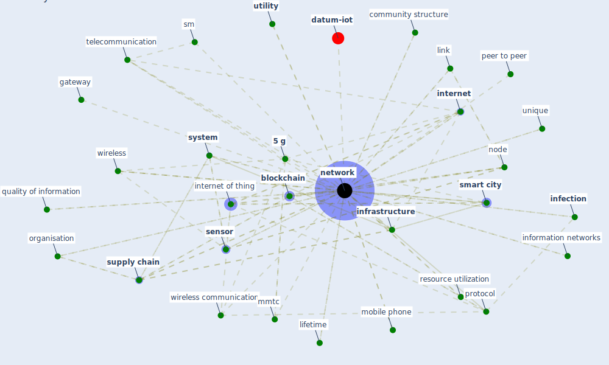

# Keyword: network

* [datum-iot](cluster_4)

## Keywords

 * [5 g](keyword_5_g), [5 g network](keyword_5_g_network), Cluster_4, [algorithm](keyword_algorithm), [analysis](keyword_analysis), [architecture](keyword_architecture), bandwidth, base station, [blockchain](keyword_blockchain), [build](keyword_build), c40 city, case risk scaled, cisco, climate technology centre, collaboration, collaborative, communication, community structure, congest, congestion, connectance distance, [datum](keyword_datum), datum processing, decentralize, deep hashing, degree, [device](keyword_device), dropping out unit, encode, european environment and epidemiology, federate learning, gateway, heterogeneity, heterogeneous, [infection](keyword_infection), informal, information network, information networks, information theoretic, infrastructural, [infrastructure](keyword_infrastructure), [innovation](keyword_innovation), insight, [internet](keyword_internet), [internet of thing](keyword_internet_of_thing), layer, lifetime, link, low latency, mhealth, mmtc, mobile phone, modularity, multimedia technology, [network](keyword_network), network resource utilization, networks, node, non time critical, opportunity, [organisation](keyword_organisation), organization, peer to peer, perception, [professional](keyword_professional), [protocol](keyword_protocol), quality of information, radio access network, redundant network, resource utilization, router, sale, scalable, scientific communication, [security](keyword_security), [sensor](keyword_sensor), server, [service](keyword_service), [sewer](keyword_sewer), sewer system, share datum, sm, [smart city](keyword_smart_city), smart city area, spectrum band, supply and production chain, [supply chain](keyword_supply_chain), [system](keyword_system), telecommunication, telecommunications network, [transmission](keyword_transmission), ultra reliability, unique, [utility](keyword_utility), vlan, [vulnerability](keyword_vulnerability), web service, wireless, wireless communication, wireless sensor

## Mapping

## Neighbours

### Closest articles

* Future (post-COVID) digital, smart and sustainable cities in the wake of 6G: Digital twins, immersive realities and new urban economies - [LINK](article_allam_future_2021)
* How the 5G Enabled the COVID-19 Pandemic Prevention and Control: Materiality, Affordance, and (De-)Spatialization - [LINK](article_li_how_2022)
* Design COVID-19 Ontology: A Healthcare and Safety Perspective - [LINK](article_aloulou_design_2022)
* A review of definitions and measures of system resilience - [LINK](article_hosseini_review_2016)
* The role of 5G for digital healthcare against COVID-19 pandemic: Opportunities and challenges - [LINK](article_siriwardhana_role_2021)
* Scalable IoT Architecture for Monitoring IEQ Conditions in Public and Private Buildings - [LINK](article_calvo_scalable_2022)
* An Automated System to Limit COVID-19 Using Facial Mask Detection in Smart City Network - [LINK](article_rahman_automated_2020)
* Continuous IEQ monitoring system: Context and development - [LINK](article_parkinson_continuous_2019)
* A comprehensive review on indoor air quality monitoring systems for enhanced public health - [LINK](article_saini_comprehensive_2020)
* Learning from the COVID-19 pandemic in governing smart cities - [LINK](article_bolivar_learning_2022)

### Closest BPs

