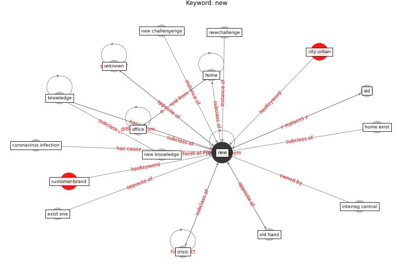

# Keyword: __new__
## Clusters

* Cluster 0: [health-city](cluster_0.md)
* Cluster 2: [construction-resilience](cluster_2.md)

## Concepts

 

## Articles
* realdania_refleksioner_2022_EN-3250 ([realdania_refleksioner_2022_EN-3250](article_realdania_refleksioner_2022_EN-3250.md))
* realdania_refleksioner_2022_EN-3300 ([realdania_refleksioner_2022_EN-3300](article_realdania_refleksioner_2022_EN-3300.md))
* realdania_refleksioner_2022_EN-1200 ([realdania_refleksioner_2022_EN-1200](article_realdania_refleksioner_2022_EN-1200.md))
* world_green_building_council_health_2014-0 ([world_green_building_council_health_2014-0](article_world_green_building_council_health_2014-0.md))
* What drives unverified information sharing and
cyberchondria during the COVID-19 pandemic? ([laato_what_2020](article_laato_what_2020.md))
* Impact of COVID-19 on IoT Adoption in Healthcare,
Smart Homes, Smart Buildings, Smart Cities,
Transportation and Industrial IoT ([umair_impact_2021](article_umair_impact_2021.md))
* realdania_refleksioner_2022_EN-2500 ([realdania_refleksioner_2022_EN-2500](article_realdania_refleksioner_2022_EN-2500.md))
* Prophylactic Architecture: Formulating the Concept
of Pandemic-Resilient Homes ([elrayies_prophylactic_2022](article_elrayies_prophylactic_2022.md))
* Mobility Behaviour in View of the Impact of the
COVID-19 Pandemic—Public Transport Users in
Gdansk Case Study ([przybylowski_mobility_2021](article_przybylowski_mobility_2021.md))
* realdania_refleksioner_2022_EN-2050 ([realdania_refleksioner_2022_EN-2050](article_realdania_refleksioner_2022_EN-2050.md))
