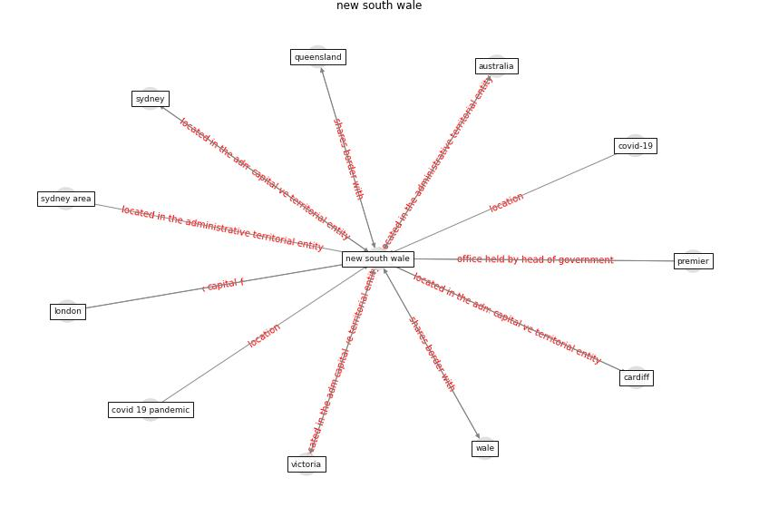

# Keyword: __new south wale__

## Concepts

 

## Top articles for __new south wale__
* Occupant health in buildings: Impact of the COVID-19
pandemic on the opinions of building professionals and
implications on research ([awada_occupant_2022](article_awada_occupant_2022))
* Navigating Climate Change: Rethinking the Role of
Buildings ([cole_navigating_2020](article_cole_navigating_2020))
* pfefferbaum_mental_2020 ([pfefferbaum_mental_2020](article_pfefferbaum_mental_2020))
* A review of facilities management interventions to
mitigate respiratory infections in existing buildings ([zhang_review_2022](article_zhang_review_2022))
