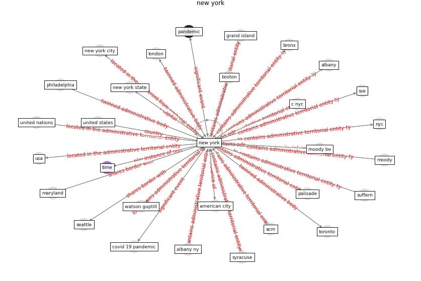

# Keyword: __new york__

## Concepts

 

## Top articles for __new york__
* Eviction, Health Inequity, and the Spread of
COVID-19: Housing Policy as a Primary Pandemic
Mitigation Strategy ([benfer_eviction_2021](article_benfer_eviction_2021))
* Learning from the COVID-19 pandemic in governing smart
cities ([bolivar_learning_2022](article_bolivar_learning_2022))
* pfefferbaum_mental_2020 ([pfefferbaum_mental_2020](article_pfefferbaum_mental_2020))
* Navigating Climate Change: Rethinking the Role of
Buildings ([cole_navigating_2020](article_cole_navigating_2020))
* pfefferbaum_mental_2020 ([pfefferbaum_mental_2020](article_pfefferbaum_mental_2020))
* A Continuously Active Antimicrobial Coating
effective against Human Coronavirus 229E ([ikner_continuously_2020](article_ikner_continuously_2020))
* Designing a Multi-Agent Occupant Simulation
System to Support Facility Planning and Analysis
for COVID-19 ([lee_designing_2021](article_lee_designing_2021))
* pfefferbaum_mental_2020 ([pfefferbaum_mental_2020](article_pfefferbaum_mental_2020))
* Urban Green Infrastructure and Green Open
Spaces: An Issue of Social Fairness in Times of
COVID-19 Crisis ([reinwald_urban_2021](article_reinwald_urban_2021))
* Coronavirus questions that will not go away: interrogating
urban and socio-spatial implications of COVID-19
measures ([salama_coronavirus_2020](article_salama_coronavirus_2020))
