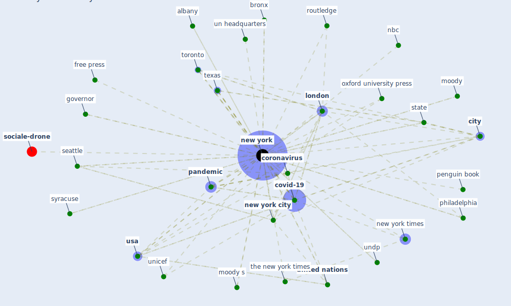

# Keyword: new york

* [sociale-drone](cluster_6)

## Keywords

 * academic press, acm, albany, albany ny, american, american city, american univ in cairo press, arizona, association for computing machinery, bangkok, basic book, bike sharing network, [boston](keyword_boston), bright green, bronx, [bsi](keyword_bsi), c nyc, [california](keyword_california), citi bike, [city](keyword_city), city office of civil justice, columbia university, [coronavirus](keyword_coronavirus), [covid 19 pandemic](keyword_covid_19_pandemic), covid 19 testing policy, [covid-19](keyword_covid-19), daily news, deborah berke, department of transportation, european, fig 6a, free press, gammel hånd, governor, grand island, guilford press, high red dot, hoboken, hot zone, leader do not, [london](keyword_london), maryland, mcgraw hill, mckinsey company, moody, moody s, mount sinai health system, nbc, new haven, new mexico, [new york](keyword_new_york), [new york city](keyword_new_york_city), new york state, new york times, new yorker, [nyc](keyword_nyc), oxford university press, palisade, [pandemic](keyword_pandemic), penguin book, philadelphia, qvtv, random house, redfin, restrict public gathering, rhinebeck, rochest, routledge, science, seattle, spon press, springer new york, sse, st martin s press, [state](keyword_state), subway, suffern, syracuse, tellic, [texas](keyword_texas), the new york times, [time](keyword_time), [toronto](keyword_toronto), u s state, un desa, un headquarters, undesirable, undp, undp new york, unicef, unicef org, [united nations](keyword_united_nations), united nations children s fund, united nations development programme, [united states](keyword_united_states), [usa](keyword_usa), van nostrand, watson, watson guptill, where new yorker move to escape coronavirus

## Mapping

## Neighbours

### Closest articles

* Designing a Multi-Agent Occupant Simulation System to Support Facility Planning and Analysis for COVID-19 - [LINK](article_lee_designing_2021)
* Mitigation strategies and compliance in the COVID-19 fight; how much compliance is enough? - [LINK](article_mukerjee_mitigation_2021)
* Urban planning after COVID-19 - [LINK](article_rtpi_urban_2021)
* How COVID-19 Could Accelerate the Adoption of New Retail Technologies and Enhance the (E-)Servicescape - [LINK](article_willems_how_2021)
* Navigating Climate Change: Rethinking the Role of Buildings - [LINK](article_cole_navigating_2020)
* World Bank Development Report - [LINK](article_world_bank_world_2022)
* Eviction, Health Inequity, and the Spread of COVID-19: Housing Policy as a Primary Pandemic Mitigation Strategy - [LINK](article_benfer_eviction_2021)
* Urban design attributes and resilience: COVID-19 evidence from New York City - [LINK](article_yang_urban_2021)
* Readiness Assessment of Green Building Certification Systems for Residential Buildings during Pandemics - [LINK](article_tleuken_readiness_2021)
* Coronavirus questions that will not go away: interrogating urban and socio-spatial implications of COVID-19 measures - [LINK](article_salama_coronavirus_2020)

### Closest BPs

