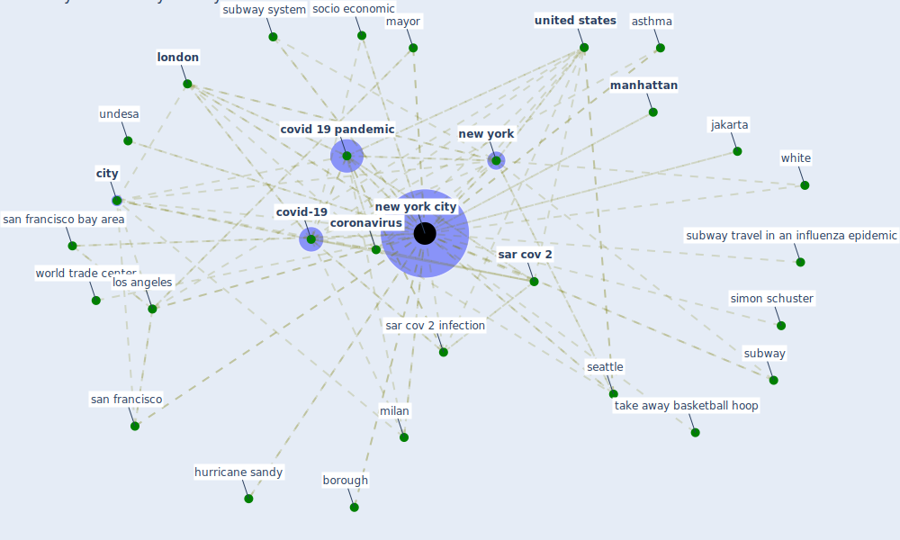

# Keyword: new york city

## Keywords

 * 19 picture of the most dangerous place in new york city right now, a nationwide closure for 12 week, albright knox college, asthma, borough, [boston](keyword_boston), brigham and woman s hospital, brigham hospital, brigham young university, brooklyn, [bueno air](keyword_bueno_air), c nyc, [city](keyword_city), city wide school closure, [coronavirus](keyword_coronavirus), coronavirus epidemic, coronavirus epidemic in new york city, coronavirus fight, [covid 19 pandemic](keyword_covid_19_pandemic), [covid-19](keyword_covid-19), daily, epidemic hotspot, h1n1 pandemic, [hong kong](keyword_hong_kong), hotel indigo, household with hvac in new york city, hurricane sandy, jakarta, k p cohen, key urban design attribute, loft, [london](keyword_london), long island, los angeles, [manhattan](keyword_manhattan), mayor, megacitie, [milan](keyword_milan), [neighborhood](keyword_neighborhood), neighborhood safety, [new york](keyword_new_york), [new york city](keyword_new_york_city), new york city police department, new york city subj oston, new york city subway, openspace park, populous, property, property value, public school, retrofitaccel, san francisco, san francisco bay area, [sar cov 2](keyword_sar_cov_2), sar cov 2 infection, school closure, seattle, simon schuster, skyscraper, socio economic, statacorp, state of new york, step, subway, subway system, subway travel in an influenza epidemic, take away basketball hoop, undesa, [united nations](keyword_united_nations), [united states](keyword_united_states), [urban](keyword_urban), white, world trade center

## Mapping

## Neighbours

### Closest articles

* Should I Stay or Should I Go? Tourists’ COVID-19 Risk Perception and Vacation Behavior Shift - [LINK](article_bratic_should_2021)
* How COVID-19 Could Accelerate the Adoption of New Retail Technologies and Enhance the (E-)Servicescape - [LINK](article_willems_how_2021)
* Prototype Early Warning Systems for Vector-Borne Diseases in Europe - [LINK](article_semenza_prototype_2015)
* A review of facilities management interventions to mitigate respiratory infections in existing buildings - [LINK](article_zhang_review_2022)
* Occupant health in buildings: Impact of the COVID-19 pandemic on the opinions of building professionals and implications on research - [LINK](article_awada_occupant_2022)
* Challenges to Mitigating the Urban Health Burden of Mosquito-Borne Diseases in the Face of Climate Change - [LINK](article_ligsay_challenges_2021)
* A Comprehensive Review of the COVID-19 Pandemic and the Role of IoT, Drones, AI, Blockchain, and 5G in Managing its Impact - [LINK](article_chamola_comprehensive_2020)
* A Review on Building Design as a Biomedical System for Preventing COVID-19 Pandemic - [LINK](article_amran_review_2022)
* Urban design attributes and resilience: COVID-19 evidence from New York City - [LINK](article_yang_urban_2021)
* COVID-19 Lockdown: Housing Built Environment’s Effects on Mental Health - [LINK](article_amerio_covid-19_2020)

### Closest BPs

