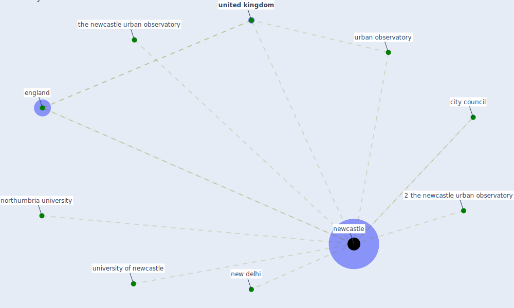

# Keyword: newcastle

## Keywords

 * 2 the newcastle urban observatory, city council, england, new delhi, [newcastle](keyword_newcastle), northumbria university, the newcastle urban observatory, [united kingdom](keyword_united_kingdom), university of newcastle, urban observatory

## Mapping

## Neighbours

### Closest articles

* Smart cities and a data-driven response to COVID-19 - [LINK](article_james_smart_2020)
* Impact of COVID-19 on IoT Adoption in Healthcare, Smart Homes, Smart Buildings, Smart Cities, Transportation and Industrial IoT - [LINK](article_umair_impact_2021)
* The COVID-19 pandemic: Impacts on cities and major lessons for urban planning, design, and management - [LINK](article_sharifi_covid-19_2020)
* Contributions of Smart City Solutions and Technologies to Resilience against the COVID-19 Pandemic: A Literature Review - [LINK](article_sharifi_contributions_2021)
* Social distancing enhanced automated optimal design of physical spaces in the wake of the COVID-19 pandemic - [LINK](article_ugail_social_2021)

### Closest BPs

