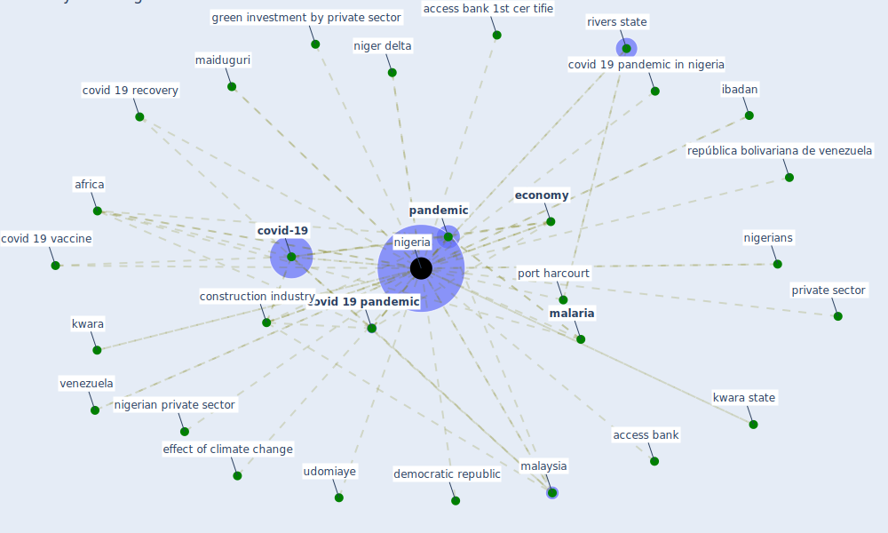

# Keyword: nigeria

## Keywords

 * abuja, access bank, access bank 1st cer tifie, access to electricity, adefemi k, [africa](keyword_africa), african, agile and responsive institution, aigbavboa, ao, climate bond, [climate change](keyword_climate_change), [construction](keyword_construction), construction in nigeria, [construction industry](keyword_construction_industry), continent, coronavirus outbreak in nigeria, coronavirus outbreak innigeria, covid 19 and food security, covid 19 and food security panel data evidence, covid 19 in nigeria, covid 19 lockdown, covid 19 lockdown nigeria, [covid 19 pandemic](keyword_covid_19_pandemic), covid 19 pandemic in nigeria, covid 19 recovery, covid 19 response and management, covid 19 vaccine, covid 19 vaccine in nigeria, [covid-19](keyword_covid-19), current pandemic, democratic republic, disaster risk reduction, ebola outbreak, [economy](keyword_economy), effect of climate change, effects of climate change in nigeria, fulani herdsman crisis, green bond, green investment, green investment by private sector, heightened, heightened risk from climate change, ibadan, [infrastructure](keyword_infrastructure), kwara, kwara state, lago, lapo, lapo microfinance bank, latin america, [lockdown](keyword_lockdown), maiduguri, [malaria](keyword_malaria), [malaysia](keyword_malaysia), mc, newsone, niger, niger delta, [nigeria](keyword_nigeria), nigerian private sector, nigerians, obi ani, [pandemic](keyword_pandemic), port harcourt, private sector, república bolivariana de venezuela, resilience building in nigeria, river, rivers state, socioeconomic landscape, [south africa](keyword_south_africa), sovereign, sovereign green, [surveillance](keyword_surveillance), surveillance was heightened, the current pandemic, the economy, udomiaye, university of port harcourt, uwana, venezuela

## Mapping

## Neighbours

### Closest articles

* COVID-19 risks and systemic gaps in Nigeria: resilience building lessons for pandemic and climate change management - [LINK](article_lawal_covid-19_2022)
* World Bank Development Report - [LINK](article_world_bank_world_2022)
* Urban planning after COVID-19 - [LINK](article_rtpi_urban_2021)
* Knowledge, attitudes, and practices of Indonesian residents regarding COVID-19: A national cross-sectional survey - [LINK](article_yodang_knowledge_2021)
* Occupant health in buildings: Impact of the COVID-19 pandemic on the opinions of building professionals and implications on research - [LINK](article_awada_occupant_2022)
* COVID-19 pandemic: the effects and prospects in the construction industry. - [LINK](article_ogunnusi_covid-19_2020)
* Ten questions concerning occupant health in buildings during normal operations and extreme events including the COVID-19 pandemic - [LINK](article_awada_ten_2021)
* Analysis of COVID-19 Concerns Raised by the Construction Workforce and Development of Mitigation Practices - [LINK](article_bou_hatoum_analysis_2021)
* Architectural design strategies for infection prevention and control (IPC) in health-care facilities: towards curbing the spread of Covid-19 \textbar SpringerLink - [LINK](article_udomiaye_architectural_2020)
* Influence between COVID-19 Impacts and Project Stakeholders in Chilean Construction Projects - [LINK](article_araya_influence_2021)

### Closest BPs

