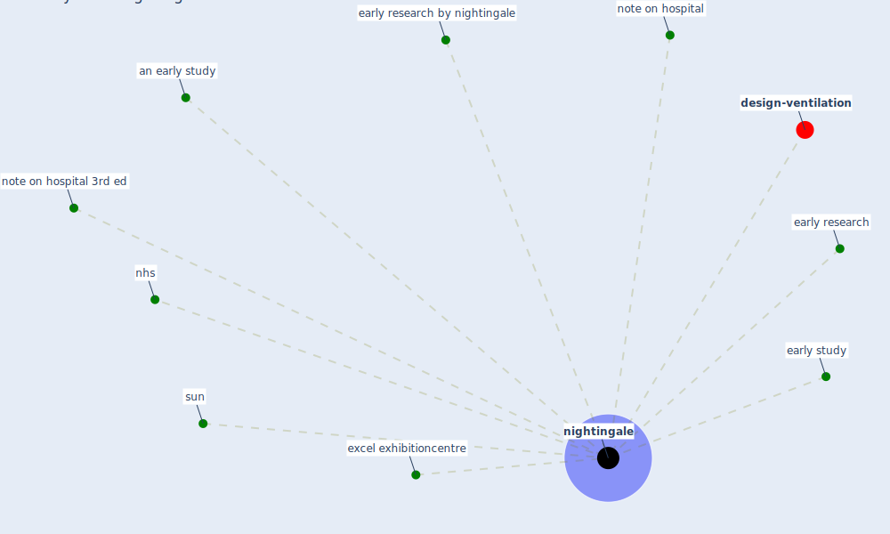

# Keyword: nightingale

* [design-ventilation](cluster_12)

## Keywords

 * Cluster_12, an early study, early research, early research by nightingale, early study, excel exhibitioncentre, nhs, [nightingale](keyword_nightingale), note on hospital, note on hospital 3rd ed, sun

## Mapping

## Neighbours

### Closest articles

* Architectural design strategies for infection prevention and control (IPC) in health-care facilities: towards curbing the spread of Covid-19 \textbar SpringerLink - [LINK](article_udomiaye_architectural_2020)
* A Review on Building Design as a Biomedical System for Preventing COVID-19 Pandemic - [LINK](article_amran_review_2022)
* Emergency Healthcare Facilities: Managing Design in a Post Covid-19 World - [LINK](article_marinelli_emergency_2020)
* Digital Twin of COVID-19 Mass Vaccination Centers - [LINK](article_pilati_digital_2021)

### Closest BPs

