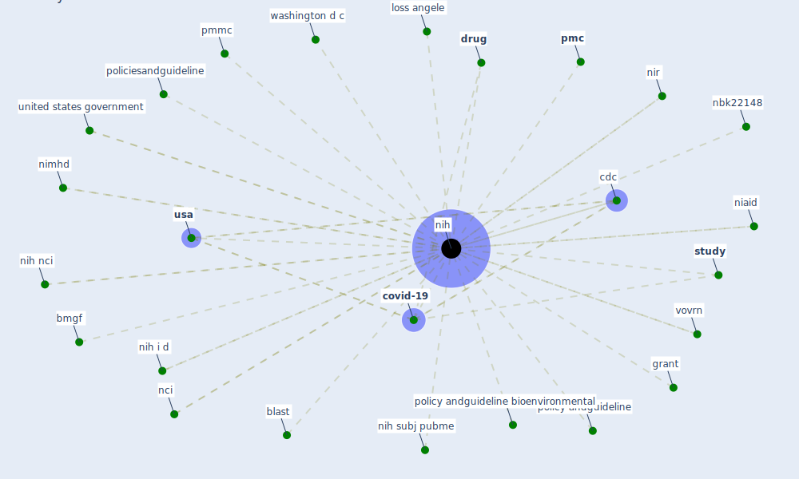

# Keyword: nih

## Keywords

 * blast, bmgf, [cdc](keyword_cdc), [covid-19](keyword_covid-19), [drug](keyword_drug), grant, loss angele, nbk22148, nci, niaid, [nih](keyword_nih), nih i d, nih nci, nih subj pubme, nimhd, nir, [pmc](keyword_pmc), pmmc, policiesandguideline, policy andguideline, policy andguideline bioenvironmental, [study](keyword_study), united states government, [usa](keyword_usa), vovrn, washington d c

## Mapping

## Neighbours

### Closest articles

* Multilevel Analysis of Personal, Non-Medical COVID-19-Related Impact Worldwide - [LINK](article_dye_multilevel_2020)
* The socio-economic implications of the coronavirus pandemic (COVID-19): A review - [LINK](article_nicola_socio-economic_2020)
* Applications of ultraviolet germicidal irradiation disinfection in health care facilities: Effective adjunct, but not stand-alone technology - [LINK](article_memarzadeh_applications_2010)
* Climate and the spread of COVID-19 - [LINK](article_chen_climate_2021)
* Nurture to nature via COVID-19, a self-regenerating environmental strategy of environment in global context - [LINK](article_paital_nurture_2020)
* First detection of SARS-CoV-2 in untreated wastewaters in Italy - [LINK](article_la_rosa_first_2020)
* A Comprehensive Review of the COVID-19 Pandemic and the Role of IoT, Drones, AI, Blockchain, and 5G in Managing its Impact - [LINK](article_chamola_comprehensive_2020)
* Making green infrastructure healthier infrastructure - [LINK](article_lohmus_making_2015)
* Integrating rapid risk mapping and mobile phone call record data for strategic malaria elimination planning - [LINK](article_tatem_integrating_2014)
* Strengthening resilience: a priority shared by Health 2020 and - [LINK](article_who_strengthening_2017)

### Closest BPs

