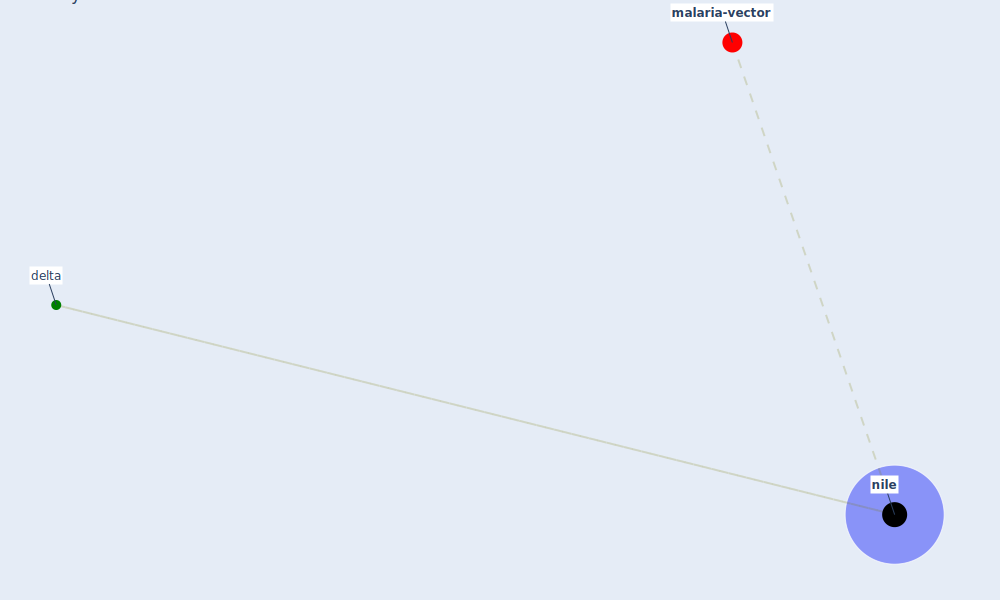

# Keyword: nile

* [malaria-vector](cluster_13)

## Keywords

 * Cluster_13, delta, [nile](keyword_nile)

## Mapping

## Neighbours

### Closest articles

* The impact of climate change on the epidemiology and control of Rift Valley fever - PubMed - [LINK](article_martin_impact_2008)

### Closest BPs

