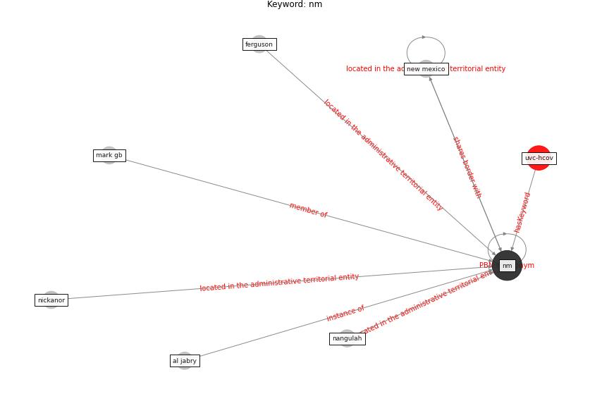

# Keyword: __nm__
## Clusters

* Cluster 5: [uvc-hcov](cluster_5)

## Concepts

 

## Top 10 articles for __nm__
* Exploring the Non-Medical impacts of Covid-19 using
Natural Language Processing ([agade_exploring_2020](article_agade_exploring_2020))
* onway-morris_removal_2021 ([onway-morris_removal_2021](article_onway-morris_removal_2021))
* Management of the COVID-19 pandemic: challenges,
practices, and organizational support ([hossny_management_2022](article_hossny_management_2022))
* Mitigation strategies and compliance in the COVID-19
fight; how much compliance is enough? ([mukerjee_mitigation_2021](article_mukerjee_mitigation_2021))
