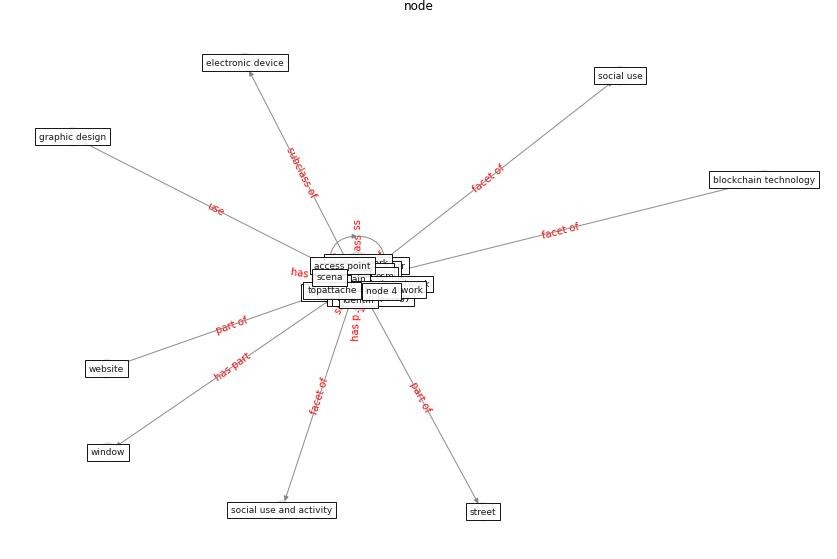

# Keyword: __node__
## Clusters

* Cluster 5: [ieq-sensor](cluster_5)
* Cluster 14: [onlinelibrary-wiley](cluster_14)

## Concepts

 

## Articles
* Scalable IoT Architecture for Monitoring IEQ
Conditions in Public and Private Buildings ([calvo_scalable_2022](article_calvo_scalable_2022))
* COVID19-Routes: A Safe Pedestrian Navigation
Service ([cantarero_covid19-routes_2021](article_cantarero_covid19-routes_2021))
* A review of definitions and measures of system
resilience ([hosseini_review_2016](article_hosseini_review_2016))
* Blockchain technology and its applications to combat
COVID-19 pandemic ([sharma_blockchain_2022](article_sharma_blockchain_2022))
* Continuous IEQ monitoring system: Context and
development ([parkinson_continuous_2019](article_parkinson_continuous_2019))
* A Comprehensive Review of the COVID-19 Pandemic
and the Role of IoT, Drones, AI, Blockchain, and
5G in Managing its Impact ([chamola_comprehensive_2020](article_chamola_comprehensive_2020))
* Association of built environment attributes with the
spread of COVID-19 at its initial stage in China ([li_association_2021](article_li_association_2021))
* 10 Adaptive Measures for Public Places to face the
COVID 19 Pandemic Outbreak ([cheshmehzangi_10_2020](article_cheshmehzangi_10_2020))
* Challenges of data sharing in European Covid-19
projects: A learning opportunity for advancing pandemic
preparedness and response ([tacconelli_challenges_2022](article_tacconelli_challenges_2022))
* Future (post-COVID) digital, smart and sustainable
cities in the wake of 6G: Digital twins, immersive
realities and new urban economies ([allam_future_2021](article_allam_future_2021))
