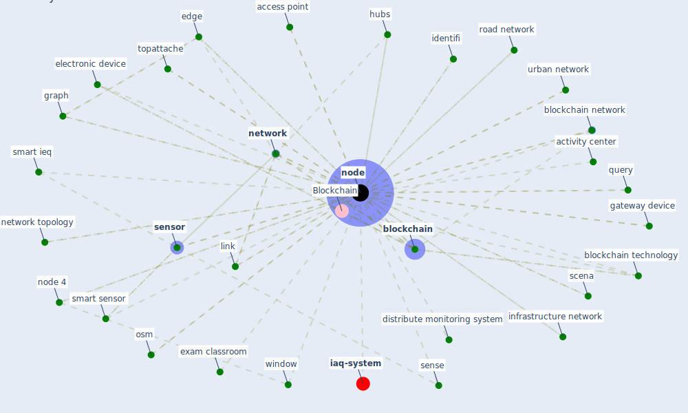

# Keyword: node

* [iaq-system](cluster_3)

## Keywords

 * Cluster_3, access point, activity center, [amenity](keyword_amenity), [blockchain](keyword_blockchain), blockchain network, [blockchain technology](keyword_blockchain_technology), distribute, distribute monitoring, distribute monitoring system, edge, electronic device, exam classroom, gateway device, graph, graphic design, hub, hubs, identifi, [ieq](keyword_ieq), infrastructure network, laboratory, link, memory, mesh network, [network](keyword_network), network topology, [node](keyword_node), node 4, node identifier, nodes, nodesnode, osm, osm entity, publish topattached, query, road network, scena, sense, sense device, [sensor](keyword_sensor), sensor nod, [smart ieq](keyword_smart_ieq), smart sensor, spjk e, street, topattache, transaction, urban network, [window](keyword_window)

## Mapping

## Neighbours

### Closest articles

* Scalable IoT Architecture for Monitoring IEQ Conditions in Public and Private Buildings - [LINK](article_calvo_scalable_2022)
* COVID19-Routes: A Safe Pedestrian Navigation Service - [LINK](article_cantarero_covid19-routes_2021)
* A review of definitions and measures of system resilience - [LINK](article_hosseini_review_2016)
* Continuous IEQ monitoring system: Context and development - [LINK](article_parkinson_continuous_2019)
* Blockchain technology and its applications to combat COVID-19 pandemic - [LINK](article_sharma_blockchain_2022)
* A Comprehensive Review of the COVID-19 Pandemic and the Role of IoT, Drones, AI, Blockchain, and 5G in Managing its Impact - [LINK](article_chamola_comprehensive_2020)
* Association of built environment attributes with the spread of COVID-19 at its initial stage in China - [LINK](article_li_association_2021)
* Future (post-COVID) digital, smart and sustainable cities in the wake of 6G: Digital twins, immersive realities and new urban economies - [LINK](article_allam_future_2021)
* Challenges of data sharing in European Covid-19 projects: A learning opportunity for advancing pandemic preparedness and response - [LINK](article_tacconelli_challenges_2022)
* 10 Adaptive Measures for Public Places to face the COVID 19 Pandemic Outbreak - [LINK](article_cheshmehzangi_10_2020)

### Closest BPs

