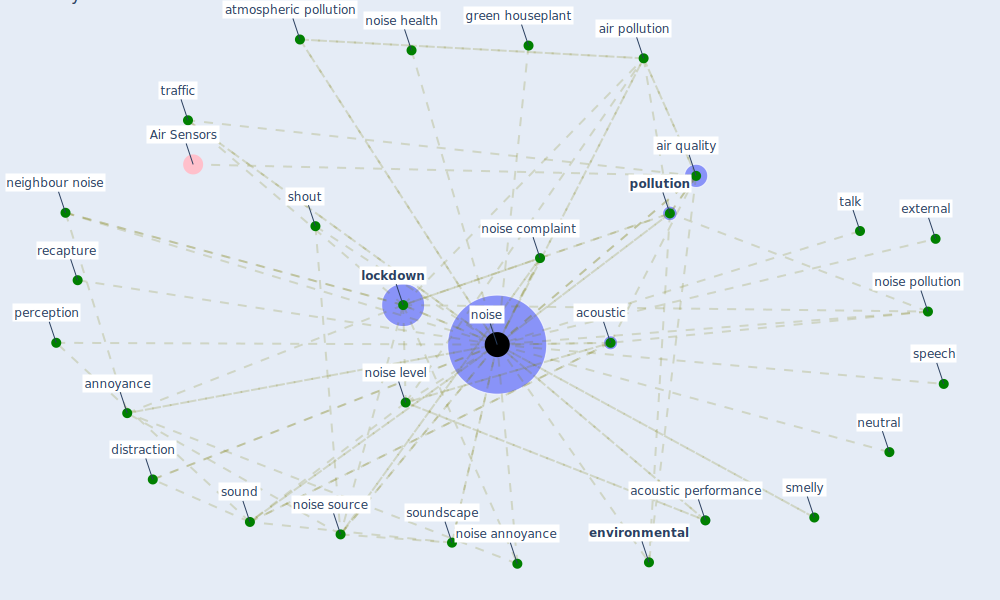

# Keyword: noise

## Keywords

 * 40dba39, 5 source of noise, acoustic, acoustic performance, [air](keyword_air), [air pollution](keyword_air_pollution), air quality, ambient noise, [analysis](keyword_analysis), [annoyance](keyword_annoyance), anthropogenic hazard, atmospheric pollution, background music, background sound level, build science, [building](keyword_building), [concentration](keyword_concentration), [construction](keyword_construction), [datum](keyword_datum), discomfort, disruption, dissatisfaction, dissatisfaction with the office environment, distraction, electric vehicle, electron, [environmental](keyword_environmental), european city, external, extraction process, flat, footstep, gaussian kernel, gender, gidlo f gunnarsson, green houseplant, [health](keyword_health), health and well be, hear, [information](keyword_information), [knowledge](keyword_knowledge), [learn](keyword_learn), [lockdown](keyword_lockdown), mislead, neighbour, [neighbour noise](keyword_neighbour_noise), neutral, [noise](keyword_noise), noise annoyance, noise complaint, noise health, noise in air, noise in the street, noise level, noise pollution, [noise source](keyword_noise_source), noise standard, noises, normalization, odor, outdoor, outdoor noise, outlier datum, pac, [pandemic](keyword_pandemic), [particle](keyword_particle), perception, [pollution](keyword_pollution), population base, recapture, restful sleep, road traffic, [sensor](keyword_sensor), short term, shout, [sleep](keyword_sleep), sleep distur bance, sleep quality, smartphone app, smelly, [sound](keyword_sound), sound level, sound wave, soundscape, source of noise, speech, standard error, structureborne, talk, talk shout, telephone, threshold limit value, [traffic](keyword_traffic), tweet, [twitter](keyword_twitter), urban soundscape, vibration, [vocs](keyword_vocs), [well be](keyword_well_be), wind turbine

## Mapping

## Neighbours

### Closest articles

* Attitudes towards outdoor and neighbour noise during the COVID-19 lockdown: A case study in London - [LINK](article_lee_attitudes_2021)
* Health, Wellbeing \& Productivity in Offices - [LINK](article_world_green_building_council_health_2014)
* Nurture to nature via COVID-19, a self-regenerating environmental strategy of environment in global context - [LINK](article_paital_nurture_2020)
* Questioning the use of the balcony in apartments during the COVID-19 pandemic process - [LINK](article_aydin_questioning_2020)
* Readiness Assessment of Green Building Certification Systems for Residential Buildings during Pandemics - [LINK](article_tleuken_readiness_2021)
* Occupant health in buildings: Impact of the COVID-19 pandemic on the opinions of building professionals and implications on research - [LINK](article_awada_occupant_2022)
* Prophylactic Architecture: Formulating the Concept of Pandemic-Resilient Homes - [LINK](article_elrayies_prophylactic_2022)
* A critical analysis of the impacts of COVID-19 on the global economy and ecosystems and opportunities for circular economy strategies - [LINK](article_ibn-mohammed_critical_2021)
* A review of facilities management interventions to mitigate respiratory infections in existing buildings - [LINK](article_zhang_review_2022)
* An Intelligent IEQ Monitoring and Feedback System: Development and Applications - [LINK](article_geng_intelligent_2021)

### Closest BPs

