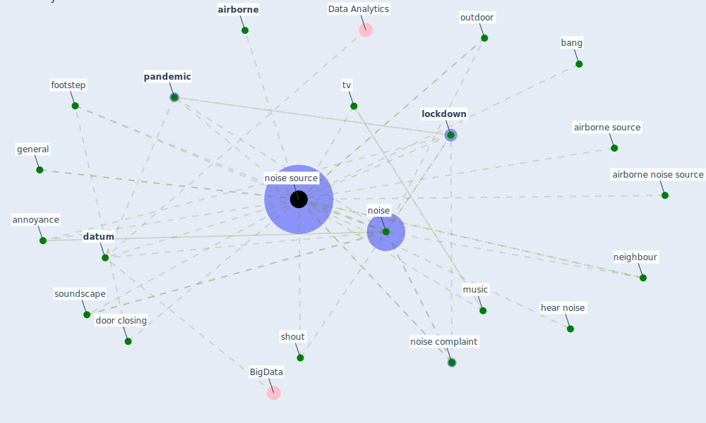

# Keyword: noise source

## Keywords

 * [airborne](keyword_airborne), airborne noise source, airborne source, [annoyance](keyword_annoyance), bang, [datum](keyword_datum), door closing, footstep, general, hear noise, [lockdown](keyword_lockdown), music, neighbour, [noise](keyword_noise), noise complaint, [noise source](keyword_noise_source), noise sources, outdoor, [pandemic](keyword_pandemic), shout, soundscape, tv

## Mapping

## Neighbours

### Closest articles

* Attitudes towards outdoor and neighbour noise during the COVID-19 lockdown: A case study in London - [LINK](article_lee_attitudes_2021)

### Closest BPs

