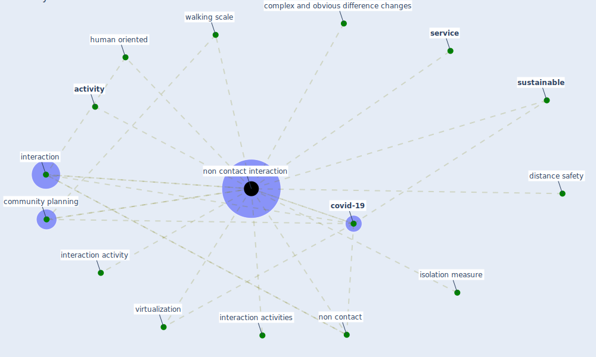

# Keyword: non contact interaction

## Keywords

 * [activity](keyword_activity), community planning, complex and obvious difference changes, [covid-19](keyword_covid-19), distance safety, human oriented, [interaction](keyword_interaction), interaction activities, interaction activity, isolation measure, non contact, [non contact interaction](keyword_non_contact_interaction), [service](keyword_service), [sustainable](keyword_sustainable), virtualization, walking scale

## Mapping

## Neighbours

### Closest articles

* Urban Community Sustainable Development Patterns under the Influence of COVID-19: A Case Study Based on the Non-Contact Interaction Perspective of Hangzhou City - [LINK](article_wang_urban_2021)

### Closest BPs

