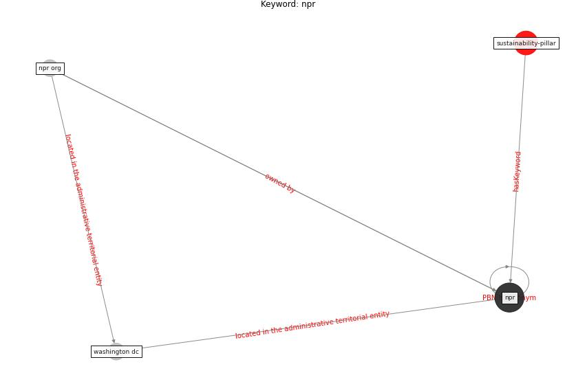

# Keyword: npr

* [sustainability-pillar](cluster_Cluster_0)

## Keywords

 * Cluster_0, [npr](keyword_npr), npr org, [washington dc](keyword_washington_dc)

## Concepts

 

## Neighbours

### Closest articles

* How COVID-19 Redefines the Concept of Sustainability - [LINK](article_hakovirta_how_2020)
* How COVID-19 Could Accelerate the Adoption of New Retail Technologies and Enhance the (E-)Servicescape - [LINK](article_willems_how_2021)
* COVID-19 as a Harbinger of Transforming Infrastructure Resilience - [LINK](article_carvalhaes_covid-19_2020)
* The socio-economic implications of the coronavirus pandemic (COVID-19): A review - [LINK](article_nicola_socio-economic_2020)

### Closest BPs

