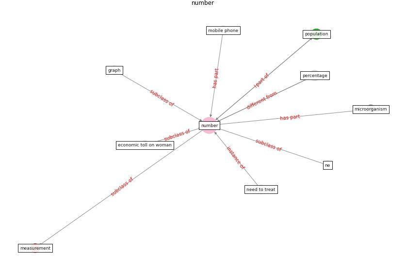

# Keyword: __number__
## Clusters

* Cluster 10: [scenario-agent](cluster_10)

## Concepts

 

## Articles
* Building occupancy estimation with people flow modeling in
AnyLogic ([li_building_2016](article_li_building_2016))
* COVID-19 misinformation: Accuracy of articles about
coronavirus prevention mostly shared on social media ([obiala_covid-19_2021](article_obiala_covid-19_2021))
* A comprehensive review on indoor air quality monitoring
systems for enhanced public health ([saini_comprehensive_2020](article_saini_comprehensive_2020))
* realdania_refleksioner_2022_EN ([realdania_refleksioner_2022_EN](article_realdania_refleksioner_2022_EN))
* Health, Economic and Social Development Challenges
of the COVID-19 Pandemic: Strategies for Multiple
and Interconnected Issues ([panneer_health_2022](article_panneer_health_2022))
* Recently employed engineering techniques to reduce the
spread of COVID-19 (corona virus disease 2019): a review
study ([saman_recently_2021](article_saman_recently_2021))
* COVID-19 media fatigue: predictors of decreasing
interest and avoidance of COVID-19–related news ([buneviciene_covid-19_2021](article_buneviciene_covid-19_2021))
* Physical interventions to interrupt or reduce the spread
of respiratory viruses: systematic review ([jefferson_physical_2008](article_jefferson_physical_2008))
* Digital Twin of COVID-19 Mass Vaccination
Centers ([pilati_digital_2021](article_pilati_digital_2021))
* COVID-19 Experience Transforming the Protective
Environment of Office Buildings and Spaces ([phapant_covid-19_2021](article_phapant_covid-19_2021))
