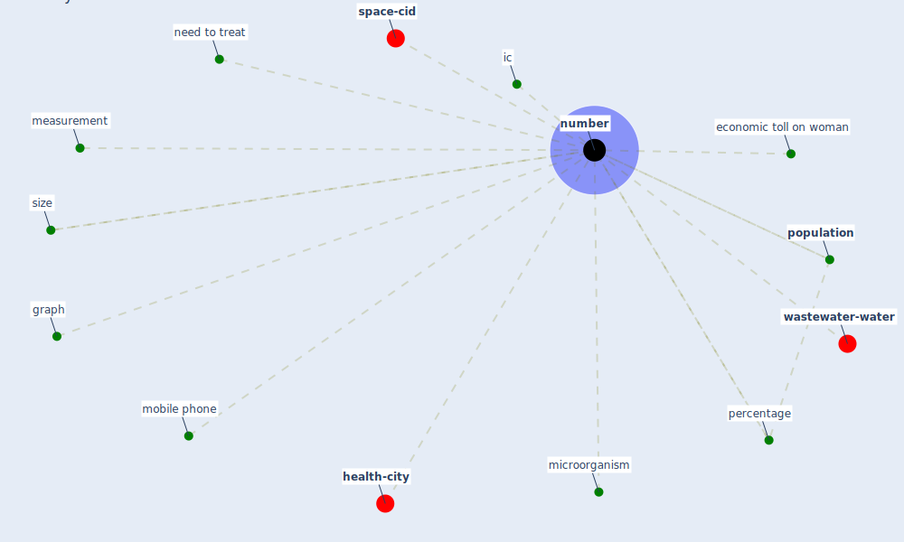

# Keyword: number

* [health-city](cluster_0)

* [wastewater-water](cluster_1)

* [space-cid](cluster_2)

## Keywords

 * Cluster_0, Cluster_1, Cluster_2, economic toll on woman, graph, ic, measurement, [microorganism](keyword_microorganism), mobile phone, need to treat, [number](keyword_number), numbers, percentage, [population](keyword_population), size

## Mapping

## Neighbours

### Closest articles

* Building occupancy estimation with people flow modeling in AnyLogic - [LINK](article_li_building_2016)
* COVID-19 misinformation: Accuracy of articles about coronavirus prevention mostly shared on social media - [LINK](article_obiala_covid-19_2021)
* A comprehensive review on indoor air quality monitoring systems for enhanced public health - [LINK](article_saini_comprehensive_2020)
* The efficacy of social distance and ventilation effectiveness in preventing COVID-19 transmission - [LINK](article_sun_efficacy_2020)
* COVID-19 media fatigue: predictors of decreasing interest and avoidance of COVID-19–related news - [LINK](article_buneviciene_covid-19_2021)
* Physical interventions to interrupt or reduce the spread of respiratory viruses: systematic review - [LINK](article_jefferson_physical_2008)
* Health, Economic and Social Development Challenges of the COVID-19 Pandemic: Strategies for Multiple and Interconnected Issues - [LINK](article_panneer_health_2022)
* Recently employed engineering techniques to reduce the spread of COVID-19 (corona virus disease 2019): a review study - [LINK](article_saman_recently_2021)
* How COVID-19 Could Accelerate the Adoption of New Retail Technologies and Enhance the (E-)Servicescape - [LINK](article_willems_how_2021)

### Closest BPs

