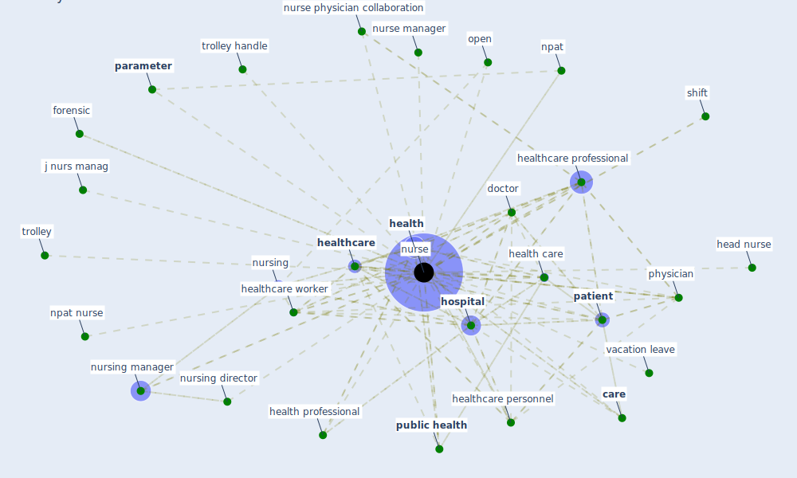

# Keyword: nurse

## Keywords

 * bmc, bmc nursing, [care](keyword_care), [clinic](keyword_clinic), clinician, doctor, dorey, forensic, glove, head nurse, [health](keyword_health), [health care](keyword_health_care), health facility, health professional, health worker, [healthcare](keyword_healthcare), healthcare personnel, healthcare professional, healthcare provider, healthcare worker, [hospital](keyword_hospital), isolation facility, j nurs manag, [medical](keyword_medical), [npat](keyword_npat), npat nurse, [nurse](keyword_nurse), nurse manager, nurse physician collaboration, nurses, [nursing](keyword_nursing), nursing director, nursing manager, open, [parameter](keyword_parameter), [patient](keyword_patient), physician, [public health](keyword_public_health), shift, trolley, trolley handle, vacation leave, work hour

## Mapping

## Neighbours

### Closest articles

* Management of the COVID-19 pandemic: challenges, practices, and organizational support - [LINK](article_hossny_management_2022)
* Digital Twin of COVID-19 Mass Vaccination Centers - [LINK](article_pilati_digital_2021)
* Supporting Technologies for COVID-19 Prevention: Systemized Review - [LINK](article_zhao_supporting_2022)
* Exploring the Non-Medical impacts of Covid-19 using Natural Language Processing - [LINK](article_agade_exploring_2020)
* COVID-19 Lockdown: Housing Built Environment’s Effects on Mental Health - [LINK](article_amerio_covid-19_2020)
* Toilets dominate environmental detection of SARS-CoV-2 virus in a hospital - [LINK](article_ding_toilets_2020)
* The COVID-19 pandemic: Lessons on building more equal and sustainable societies - [LINK](article_van_barneveld_covid-19_2020)
* Association between indoor-outdoor green features and psychological health during the COVID-19 lockdown in Italy: A cross-sectional nationwide study - [LINK](article_spano_association_2021)
* The role of 5G for digital healthcare against COVID-19 pandemic: Opportunities and challenges - [LINK](article_siriwardhana_role_2021)

### Closest BPs

