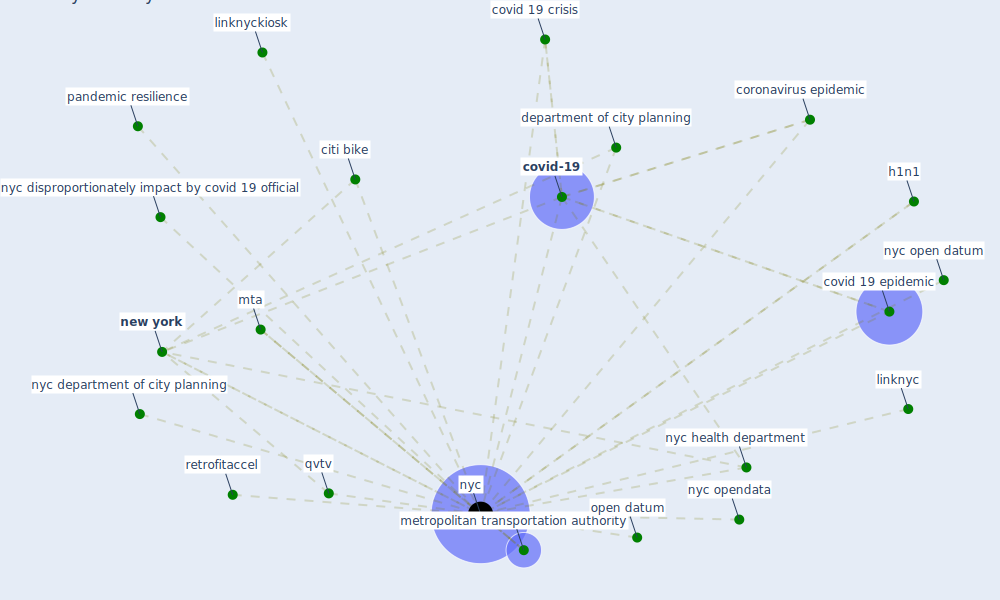

# Keyword: nyc

## Keywords

 * citi bike, coronavirus epidemic, [covid 19 crisis](keyword_covid_19_crisis), covid 19 epidemic, [covid-19](keyword_covid-19), department of city planning, h1n1, linknyc, linknyckiosk, metropolitan transportation authority, mta, [new york](keyword_new_york), [nyc](keyword_nyc), nyc department of city planning, nyc disproportionately impact by covid 19 official, nyc health department, nyc open datum, nyc opendata, open datum, pandemic resilience, qvtv, retrofitaccel

## Mapping

## Neighbours

### Closest articles

* Urban design attributes and resilience: COVID-19 evidence from New York City - [LINK](article_yang_urban_2021)
* Urban planning after COVID-19 - [LINK](article_rtpi_urban_2021)
* Respiratory pandemics, urban planning and design: A multidisciplinary rapid review of the literature - [LINK](article_harris_respiratory_2022)
* The Emergence of Anti-Privacy and Control at the Nexus between the Concepts of Safe City and Smart City - [LINK](article_allam_emergence_2019)
* Urban Green Infrastructure and Green Open Spaces: An Issue of Social Fairness in Times of COVID-19 Crisis - [LINK](article_reinwald_urban_2021)
* A Platform for Citizen Cooperation during the COVID-19 Pandemic in RN, Brazil - [LINK](article_de_araujo_platform_2020)
* A critical review of heating, ventilation, and air conditioning (HVAC) systems within the context of a global SARS-CoV-2 epidemic - [LINK](article_elsaid_critical_2021)
* COVID-ABS: An agent-based model of COVID-19 epidemic to simulate health and economic effects of social distancing interventions - [LINK](article_silva_covid-abs_2020)

### Closest BPs

