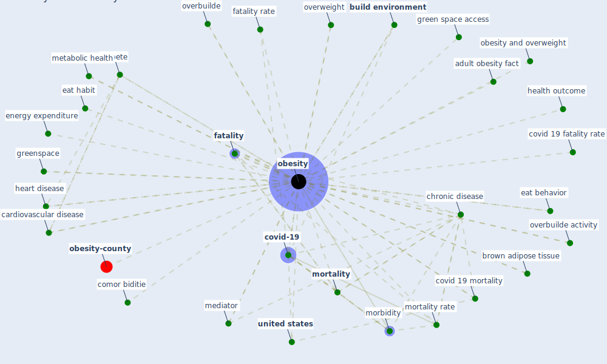

# Keyword: obesity

* [obesity-county](cluster_9)

## Keywords

 * Cluster_9, adult obesity fact, [association](keyword_association), auto centrality index, be tween, black pop ulation, brown adipose tissue, [build environment](keyword_build_environment), build environment design, cardiovascular disease, cardiovascular risk factor, center for disease control and prevention, chronic cardiovascular disease, [chronic disease](keyword_chronic_disease), chronic disease outcome, comor biditie, covid 19 fatality, covid 19 fatality rate, covid 19 mortality, covid 19infection, covid fatality, covid fatality rate, [covid-19](keyword_covid-19), covid19 fatality rate, [diabete](keyword_diabete), die from covid 19, [disease](keyword_disease), disease cause huge burden on our health, eat behavior, eat habit, [education](keyword_education), energy expenditure, fac tor, [fatality](keyword_fatality), fatality rate, food security, globally, green space access, greenspace, [health](keyword_health), health condition, health outcome, heart disease, marmot m, mediator, metabolic health, morbidity, [mortality](keyword_mortality), mortality rate, [obesity](keyword_obesity), obesity and covid 19, obesity and overweight, obesity in the united states, overbuilde, overbuilde activity, overweight, pedestrian orient link, [pollution](keyword_pollution), pre exist condition, predictor, preva lence, [prevalence](keyword_prevalence), risk factor, [sar cov 2](keyword_sar_cov_2), sar cov 2 infection, sedentary travel mode, smoking, [stress](keyword_stress), time in car, tobacco smoking, unhealthy sleep and eat habit, [united states](keyword_united_states)

## Mapping

## Neighbours

### Closest articles

* Treating two pandemics for the price of one: Chronic and infectious disease impacts of the built and natural environment - [LINK](article_frank_treating_2021)
* Refleksioner fra en pandemi - [LINK](article_realdania_refleksioner_2022)
* Green spaces, especially forest, linked to lower SARS-CoV-2 infection rates: A one-year nationwide study - [LINK](article_jiang_green_2021)
* How Architecture Fails in Conditions of Crisis: a Discussion on the Value of Interior Design over the COVID-19 Outbreak - [LINK](article_rassia_how_2020)
* Coronavirus and Climate Change - [LINK](article_harvard_th_chan_schoold_of_public_health_coronavirus_2020)
* Ten questions concerning occupant health in buildings during normal operations and extreme events including the COVID-19 pandemic - [LINK](article_awada_ten_2021)
* Coronavirus questions that will not go away: interrogating urban and socio-spatial implications of COVID-19 measures - [LINK](article_salama_coronavirus_2020)
* Pandemic Analytics: How Countries are Leveraging Big Data Analytics and Artificial Intelligence to Fight COVID-19? - [LINK](article_mehta_pandemic_2021)
* RESIDENTIAL ARCHITECTURE IN A POST-PANDEMIC WORLD: IMPLICATIONS OF COVID-19 FOR NEW CONSTRUCTION AND FOR ADAPTING HERITAGE BUILDINGS - [LINK](article_spennemann_residential_2021)
* COVID-19 media fatigue: predictors of decreasing interest and avoidance of COVID-19–related news - [LINK](article_buneviciene_covid-19_2021)

### Closest BPs

