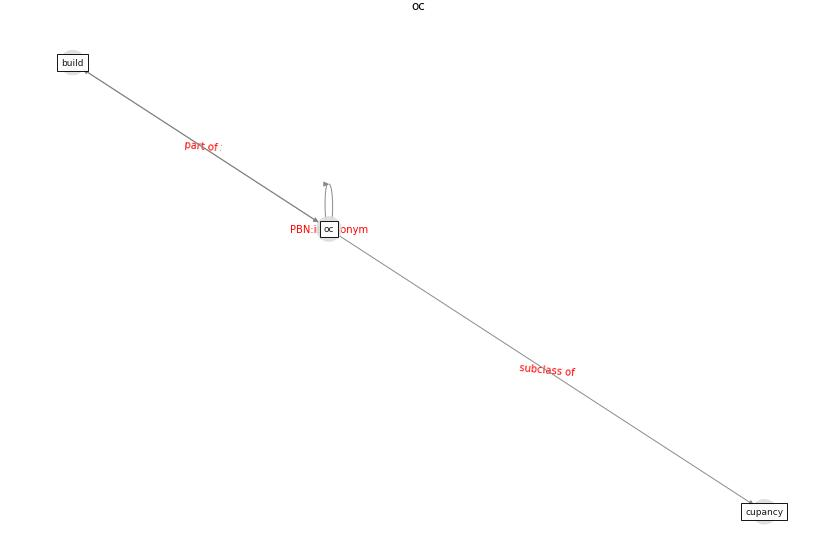

# Keyword: oc

* [uvc-hcov](cluster_Cluster_7)

## Keywords

 * Cluster_7, [build](keyword_build), cupancy, [oc](keyword_oc)

## Concepts

 

## Neighbours

### Closest articles

* Occupant health in buildings: Impact of the COVID-19 pandemic on the opinions of building professionals and implications on research - [LINK](article_awada_occupant_2022)
* Addressing the impact of COVID-19 lockdown on energy use in municipal buildings: A case study in Florianópolis, Brazil - [LINK](article_geraldi_addressing_2021)

### Closest BPs

