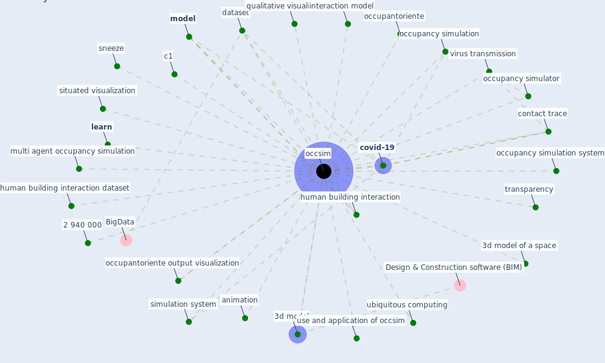

# Keyword: occsim

## Keywords

 * 2 940 000, 3d model, 3d model of a space, animation, c1, contact trace, [covid-19](keyword_covid-19), [dataset](keyword_dataset), human building interaction, human building interaction dataset, interaction model, [learn](keyword_learn), [model](keyword_model), multi agent occupancy simulation, [occsim](keyword_occsim), occupancy simulation, occupancy simulation system, occupancy simulator, occupantoriente, occupantoriente output visualization, qualitative visualization, simulation system, situated visualization, sneeze, transparency, ubiquitous computing, use and application of occsim, virus transmission

## Mapping

## Neighbours

### Closest articles

* Designing a Multi-Agent Occupant Simulation System to Support Facility Planning and Analysis for COVID-19 - [LINK](article_lee_designing_2021)

### Closest BPs

