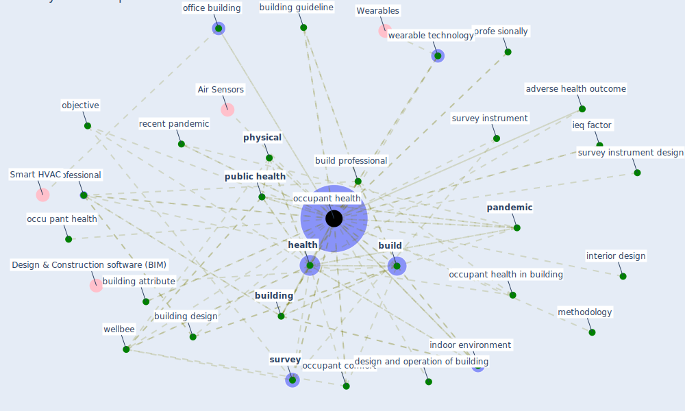

# Keyword: occupant health

## Keywords

 * adverse health outcome, [build](keyword_build), build community, build pro fessional, build professional, build relate datum, build s, [building](keyword_building), building attribute, building design, building feature, building guideline, building parameter, building type, correspond author, [covid 19 pandemic](keyword_covid_19_pandemic), covid19 pandemic, datum relate challenge, daylighte, design and operation of building, [health](keyword_health), health relate project, [healthcare](keyword_healthcare), ieq factor, [indoor air quality](keyword_indoor_air_quality), [indoor environment](keyword_indoor_environment), indoor life, indoor space, interior design, methodology, metric, negative impact, objective, occu pant health, [occupant](keyword_occupant), occupant comfort, [occupant health](keyword_occupant_health), occupant health in building, occupant well be, occupants health, office building, [pandemic](keyword_pandemic), [physical](keyword_physical), profe sionally, [professional](keyword_professional), [public health](keyword_public_health), public health research, quality of indoor life, questionnaire, recent pandemic, stressor, [survey](keyword_survey), survey instrument, survey instrument design, wearable technology, [well be](keyword_well_be), [wellbee](keyword_wellbee)

## Mapping

## Neighbours

### Closest articles

* Occupant health in buildings: Impact of the COVID-19 pandemic on the opinions of building professionals and implications on research - [LINK](article_awada_occupant_2022)
* Ten questions concerning occupant health in buildings during normal operations and extreme events including the COVID-19 pandemic - [LINK](article_awada_ten_2021)
* COVID-19 and Green Housing: A Review of Relevant Literature - [LINK](article_kaklauskas_covid-19_2021)
* A review of facilities management interventions to mitigate respiratory infections in existing buildings - [LINK](article_zhang_review_2022)
* Indoor Air Quality: Rethinking rules of building design strategies in post-pandemic architecture - [LINK](article_megahed_indoor_2021)
* Health, Wellbeing \& Productivity in Offices - [LINK](article_world_green_building_council_health_2014)
* A critical review of heating, ventilation, and air conditioning (HVAC) systems within the context of a global SARS-CoV-2 epidemic - [LINK](article_elsaid_critical_2021)
* Continuous IEQ monitoring system: Context and development - [LINK](article_parkinson_continuous_2019)
* How our homes impact our health: using a COVID-19 informed approach to examine urban apartment housing - [LINK](article_peters_how_2020)

### Closest BPs

