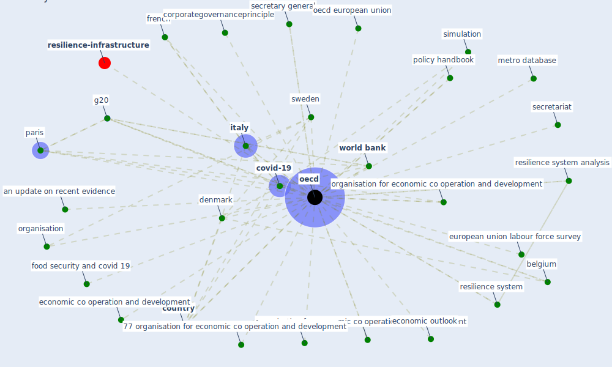

# Keyword: oecd

* [resilience-infrastructure](cluster_11)

## Keywords

 * 28 organisation, 77 organisation for economic co operation and development, Cluster_11, [africa](keyword_africa), an update on recent evidence, [analysis](keyword_analysis), analysis right, angel gurría, belgium, brenda killen, [china](keyword_china), china s economy, christine arriola, [climate change](keyword_climate_change), corporategovernanceprinciple, corrigenda, corrigenda to oecd publication, council on broadband development, [country](keyword_country), country of birth, country of origin, [covid-19](keyword_covid-19), [denmark](keyword_denmark), development, development assistance committee, disclosure platform, econmic transformation, economic analysis and policy, economic co operation and development, economic cooperation and development, economic outlook, employment, employment rate gap, employment rate gap between immigrant and the native bear, [entrepreneurship](keyword_entrepreneurship), estonia, european, european oecd country, european union labour force survey, european union labour force survey eu 27, finance, food security and covid 19, french, g20, income inequality, ireland, [italy](keyword_italy), member country, metro database, metro model, [native bear](keyword_native_bear), [netherland](keyword_netherland), norway, [oecd](keyword_oecd), oecd 2012 quality matter in early childhood education and care, oecd 2014 guideline for resilience system analysis, oecd 2014 guideline for resilience system analysis oecd publishing, oecd economic outlook, oecd employment outlook 2013, oecd european union, oecd family database, oecd guideline for resilience system analysis 16 how do we build the briefing pack, oecd policy response to corona virus covid 19 oecd paris, oecd policy response to coronavirus covid 19 ensure datum privacy as we battle covid 19, oecd policy response to coronavirus covid 19 oecd paris, oecd productivity work paper, oecd tiva database, [organisation](keyword_organisation), organisation for economic co operation and development, organisation for economic cooperation and development, organization, organization for economic co operation and development, paris, [policy](keyword_policy), policy handbook, policy option to build more resilient production network, policy response, policy response to coronavirus covid 19 ensure datum privacy as we battle covid 19, policymaker, politic, [recovery](keyword_recovery), recovery on track, regulatory policy, [resilience](keyword_resilience), resilience system, [resilience system analysis](keyword_resilience_system_analysis), risk and resilience, secretariat, secretary general, [simulation](keyword_simulation), sophie guilloux nefussi, [sweden](keyword_sweden), target communication strategy, tax, training gap, training gap for migrant, [unesco](keyword_unesco), update on recent evidence, work paper, [world bank](keyword_world_bank)

## Mapping

## Neighbours

### Closest articles

* World Bank Development Report - [LINK](article_world_bank_world_2022)
* Urban planning after COVID-19 - [LINK](article_rtpi_urban_2021)
* What has been the impact of the COVID-19 pandemic on immigrants? An update on recent evidence - [LINK](article_oecd_what_2022)
* Guidelines for resilience systems analysis - [LINK](article_oecd_guidelines_2014)
* Global value chains: Efficiency and risks in the context of COVID-19 - [LINK](article_oecd_global_2021)
* Sustainable work throughout the life course: National policies and strategies, Publications Office of the European Union - [LINK](article_eurofund_sustainable_2016)
* COVID-19 and regional solutions for mitigating the risk of SME finance in selected ASEAN member states - [LINK](article_taghizadeh-hesary_covid-19_2022)
* Covid-19 and the politics of sustainable energy transitions - [LINK](article_kuzemko_covid-19_2020)
* COVID-19 and a new resilient infrastructure landscape - [LINK](article_oecd_covid-19_2021)
* Strategies to Mitigate COVID-19 Pandemic Impacts on Health and Safety of Workers in Construction Projects - [LINK](article_kaushal_strategies_2021)

### Closest BPs

