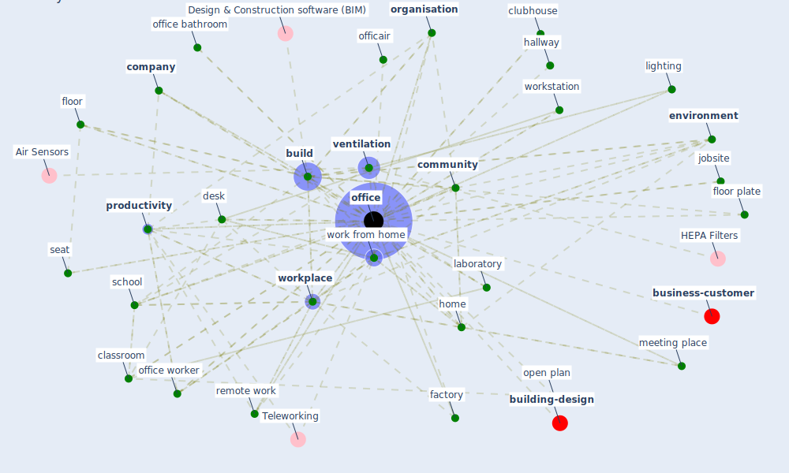

# Keyword: office

* [building-design](cluster_5)

* [business-customer](cluster_11)

## Keywords

 * Cluster_11, absence, [amenity](keyword_amenity), [bedroom](keyword_bedroom), [build](keyword_build), build s, building type, business case, call centre, campus, civil right, classroom, clerical, clubhouse, co work space, comfort, [community](keyword_community), [company](keyword_company), [construction](keyword_construction), [construction industry](keyword_construction_industry), cubicle, culture, dedicated office, [desk](keyword_desk), [employee](keyword_employee), [environment](keyword_environment), equipment, [facility management](keyword_facility_management), [factory](keyword_factory), facu an office, flexible office space, floor, floor plate, group, group office, hallway, health wellbeing productivity in office, [home](keyword_home), jobsite, laboratory, lighting, lillis hall, look and feel, meeting place, [new](keyword_new), officair, [office](keyword_office), office bathroom, office culture, office worker, open plan, open plan office, operation, [organisation](keyword_organisation), [people](keyword_people), [productivity](keyword_productivity), rehva, [remote work](keyword_remote_work), restaurant, retail, [school](keyword_school), screen base task, seat, [sector](keyword_sector), set, single occupancy, [site](keyword_site), [space](keyword_space), space type, staff, [store](keyword_store), [study](keyword_study), study place, team, the office as we know it, touch free, train station, trial, [type](keyword_type), type of activity, urban distribution, ventilate, [ventilation](keyword_ventilation), ventilation air, well seal, well seal design, [window](keyword_window), window louver, window ventilate, [work](keyword_work), work from home, work from home policy, work space, [worker](keyword_worker), [workplace](keyword_workplace), workplace environment, [workplace management](keyword_workplace_management), workplace modification, workplace modification plan, [workstation](keyword_workstation)

## Mapping

## Neighbours

### Closest articles

* Health, Wellbeing \& Productivity in Offices - [LINK](article_world_green_building_council_health_2014)
* It’s time to reimagine where and how work will get done (PwC’s US Remote Work Survey) - [LINK](article_pricewaterhousecoopers_its_2021)
* COVID-19 Experience Transforming the Protective Environment of Office Buildings and Spaces - [LINK](article_phapant_covid-19_2021)
* A study on office workplace modification during the COVID-19 pandemic in The Netherlands - [LINK](article_hou_study_2021)
* Architectural Design Drives the Biogeography of Indoor Bacterial Communities - [LINK](article_kembel_architectural_2014)
* The ventilation of buildings and other mitigating measures for COVID-19: a focus on wintertime - [LINK](article_burridge_ventilation_2021)
* Occupant health in buildings: Impact of the COVID-19 pandemic on the opinions of building professionals and implications on research - [LINK](article_awada_occupant_2022)
* A review of facilities management interventions to mitigate respiratory infections in existing buildings - [LINK](article_zhang_review_2022)
* Antivirus-built environment: Lessons learned from Covid-19 pandemic - [LINK](article_megahed_antivirus-built_2020)
* COVID-19 and Green Housing: A Review of Relevant Literature - [LINK](article_kaklauskas_covid-19_2021)

### Closest BPs

