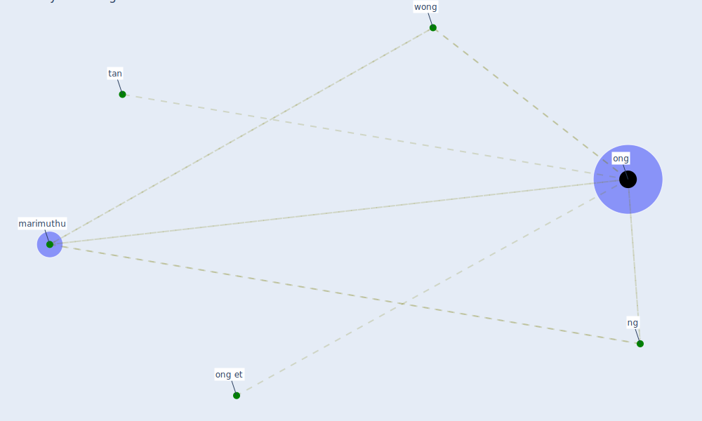

# Keyword: ong

## Keywords

 * [marimuthu](keyword_marimuthu), [ng](keyword_ng), [ong](keyword_ong), ong et, tan, [wong](keyword_wong)

## Mapping

## Neighbours

### Closest articles

* Air, Surface Environmental, and Personal Protective Equipment Contamination by Severe Acute Respiratory Syndrome Coronavirus 2 (SARS-CoV-2) From a Symptomatic Patient - [LINK](article_ong_air_2020)
* A Global Survey of Infection Control and Mitigation Measures for Combating the Transmission of COVID-19 Pandemic in Buildings Under Facilities Management Services - [LINK](article_sarvari_global_2022)

### Closest BPs

