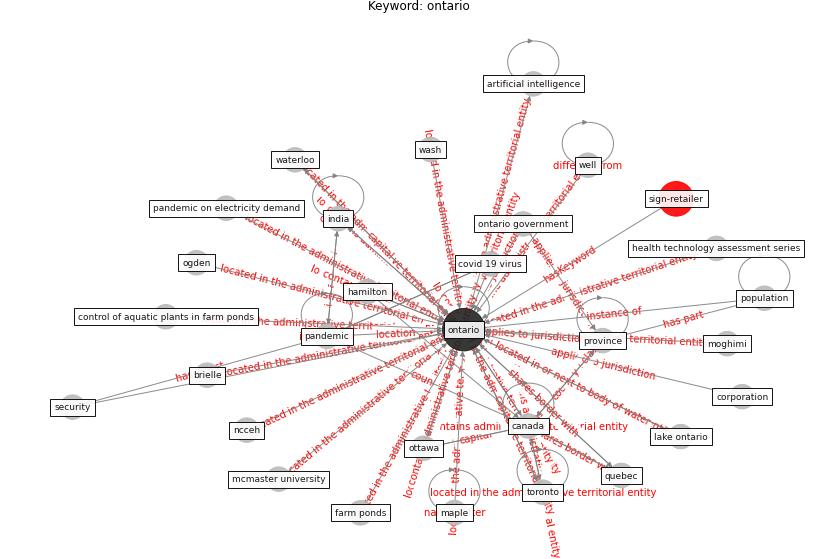

# Keyword: ontario

* [sign-retailer](cluster_Cluster_8)

## Keywords

 * Cluster_8, [artificial intelligence](keyword_artificial_intelligence), brielle, [canada](keyword_canada), control of aquatic plants in farm ponds, [corporation](keyword_corporation), covid 19 virus, farm ponds, hamilton, health technology assessment series, [india](keyword_india), lake ontario, maple, mcmaster university, moghimi, ncceh, ogden, [ontario](keyword_ontario), ontario government, ottawa, [pandemic](keyword_pandemic), pandemic on electricity demand, [population](keyword_population), [province](keyword_province), quebec, [security](keyword_security), [toronto](keyword_toronto), wash, waterloo, [well](keyword_well), wiktorowicz

## Concepts

 

## Neighbours

### Closest articles

* Retail Signage During the COVID-19 Pandemic - [LINK](article_mcneish_retail_2020)
* Association of built environment attributes with the spread of COVID-19 at its initial stage in China - [LINK](article_li_association_2021)
* What has been the impact of the COVID-19 pandemic on immigrants? An update on recent evidence - [LINK](article_oecd_what_2022)
* Amplifying the role of knowledge translation platforms in the COVID-19 pandemic response - [LINK](article_el-jardali_amplifying_2020)
* COVID-ABS: An agent-based model of COVID-19 epidemic to simulate health and economic effects of social distancing interventions - [LINK](article_silva_covid-abs_2020)
* Urban Green Infrastructure and Green Open Spaces: An Issue of Social Fairness in Times of COVID-19 Crisis - [LINK](article_reinwald_urban_2021)
* Effects of temperature and humidity on the spread of COVID-19: A systematic review - [LINK](article_mecenas_effects_2020)
* Reframe how to serve your community in the midst of a pandemic - [LINK](article_sutton_reframe_2020)
* Contextualizing the Covid-19 pandemic for a carbon-constrained world: Insights for sustainability transitions, energy justice, and research methodology - [LINK](article_sovacool_contextualizing_2020)
* Impacts of COVID-19 on Health and Safety of Workforce in Construction Industry - [LINK](article_pamidimukkala_impacts_2021)

### Closest BPs

