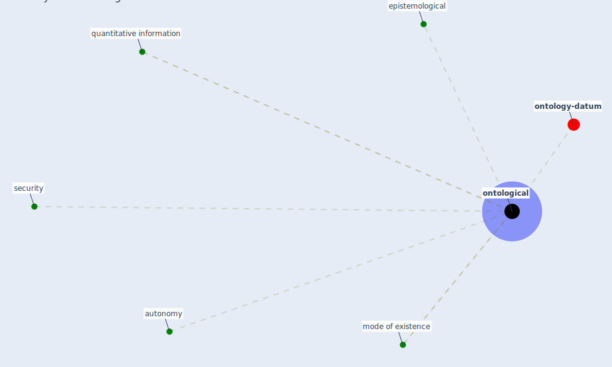

# Keyword: ontological

* [ontology-datum](cluster_12)

## Keywords

 * Cluster_12, autonomy, epistemological, [mode of existence](keyword_mode_of_existence), [ontological](keyword_ontological), quantitative information, [security](keyword_security)

## Mapping

## Neighbours

### Closest articles

* The three modes of existence of the pandemic smart city - [LINK](article_soderstrom_three_2021)
* The COVID-19 epidemiology and monitoring ontology - [LINK](article_queralt-rosinach_covid-19_2021)
* Dangerous liaisons? Applying the social harm perspective to the social inequality, housing and health trifecta during the Covid-19 pandemic - [LINK](article_gurney_dangerous_2021)

### Closest BPs

