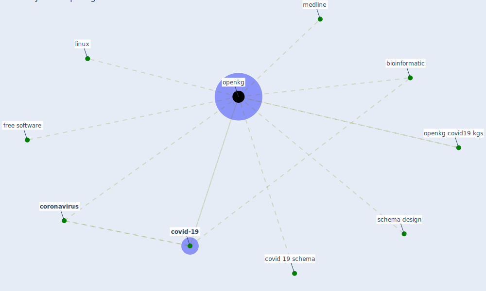

# Keyword: openkg

## Keywords

 * bioinformatic, [coronavirus](keyword_coronavirus), covid 19 schema, [covid-19](keyword_covid-19), free software, linux, medline, [openkg](keyword_openkg), openkg covid19 kgs, schema design

## Mapping

## Neighbours

### Closest articles

* Construction of a Linked Data Set of COVID-19 Knowledge Graphs: Development and Applications - [LINK](article_wang_construction_2022)

### Closest BPs

