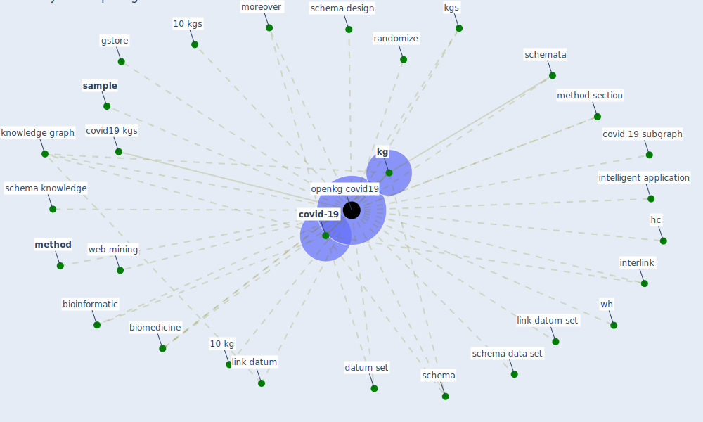

# Keyword: openkg covid19

## Keywords

 * 10 kg, 10 kgs, bioinformatic, biomedicine, covid 19 subgraph, [covid-19](keyword_covid-19), covid19 kgs, datum set, gstore, hc, intelligent application, interlink, [kg](keyword_kg), kgs, knowledge graph, link datum, link datum set, [method](keyword_method), method section, moreover, [openkg covid19](keyword_openkg_covid19), randomize, [sample](keyword_sample), schema, schema data set, schema design, schema knowledge, schemata, web mining, wh

## Mapping

## Neighbours

### Closest articles

* Construction of a Linked Data Set of COVID-19 Knowledge Graphs: Development and Applications - [LINK](article_wang_construction_2022)

### Closest BPs

