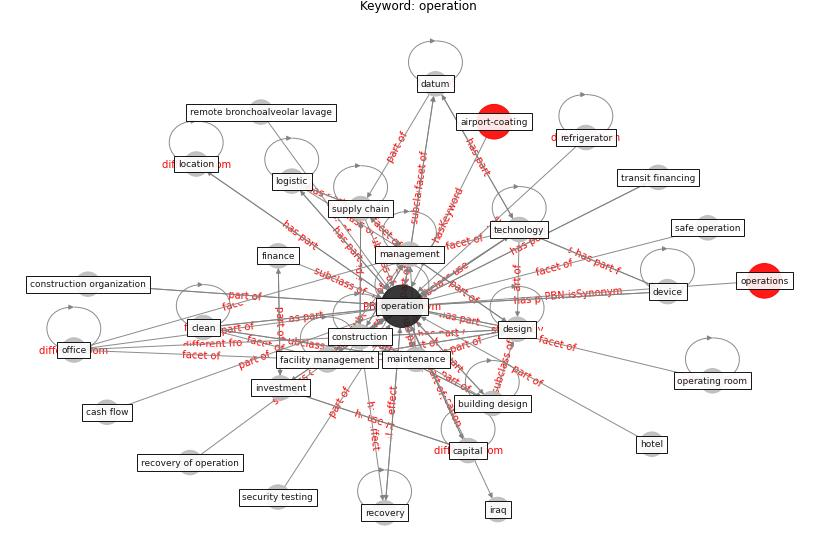

# Keyword: operation

* [airport-coating](cluster_Cluster_6)

## Keywords

 * Cluster_6, afghanistan, [build](keyword_build), [building](keyword_building), building design, [business](keyword_business), business model, capital, cash flow, central bank, [clean](keyword_clean), communication, complex, computer, [construction](keyword_construction), [construction company](keyword_construction_company), construction organization, [datum](keyword_datum), decommissioning, demand, demand time, [design](keyword_design), device, electric appliance, [facility management](keyword_facility_management), facility management team, finance, governance, hardware supply chain, hazard, hotel, human resource, [infrastructure](keyword_infrastructure), installation, investment, iraq, lifecycle, live intelligence, location, [logistic](keyword_logistic), [maintenance](keyword_maintenance), management, medicine, [model](keyword_model), network maintenance, [office](keyword_office), operating room, operating room preparation, [operation](keyword_operation), operations, production management, [recovery](keyword_recovery), recovery action, recovery of operation, refrigerator, refurbishment, remote bronchoalveolar lavage, retail, safe operation, [sample](keyword_sample), sample time, sanitize, security testing, [supply chain](keyword_supply_chain), [technology](keyword_technology), time schedule, transit financing, visual touchscreen, [wifi](keyword_wifi)

## Concepts

 

## Neighbours

### Closest articles

* A Global Survey of Infection Control and Mitigation Measures for Combating the Transmission of COVID-19 Pandemic in Buildings Under Facilities Management Services - [LINK](article_sarvari_global_2022)
* Occupant health in buildings: Impact of the COVID-19 pandemic on the opinions of building professionals and implications on research - [LINK](article_awada_occupant_2022)
* Scalable IoT Architecture for Monitoring IEQ Conditions in Public and Private Buildings - [LINK](article_calvo_scalable_2022)
* A review of definitions and measures of system resilience - [LINK](article_hosseini_review_2016)
* How COVID-19 Could Accelerate the Adoption of New Retail Technologies and Enhance the (E-)Servicescape - [LINK](article_willems_how_2021)
* A review of facilities management interventions to mitigate respiratory infections in existing buildings - [LINK](article_zhang_review_2022)
* The effect of a redesigned floor plan, occupant density and the quality of indoor climate on the cost of space, productivity and sick leave in an office building–A case study - [LINK](article_saari_effect_2006)
* Assessment of COVID-19 precautionary measures in sports facilities: A case study on a health club in Saudi Arabia - [LINK](article_ibrahim_assessment_2022)
* World Bank Development Report - [LINK](article_world_bank_world_2022)
* Strategies to Mitigate COVID-19 Pandemic Impacts on Health and Safety of Workers in Construction Projects - [LINK](article_kaushal_strategies_2021)

### Closest BPs

