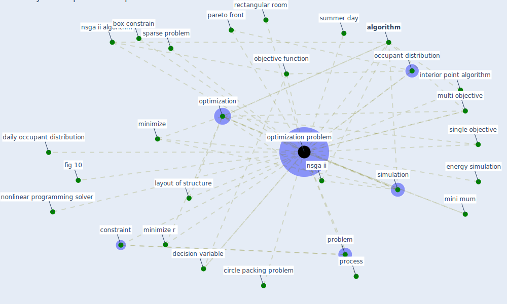

# Keyword: optimization problem

## Keywords

 * [algorithm](keyword_algorithm), box constrain, circle pack algorithm, circle packing problem, [constraint](keyword_constraint), daily occupant distribution, decision variable, [energy consumption](keyword_energy_consumption), energy simulation, fig 10, interior point algorithm, layout of structure, mini mum, minimize, minimize r, multi objective, nonlinear programming solver, nsga ii, nsga ii algorithm, objective function, occupant distribution, optimization, [optimization problem](keyword_optimization_problem), optimization problems, pareto front, problem, process, rectangular room, [simulation](keyword_simulation), single objective, small dense problem, sparse problem, summer day

## Mapping

## Neighbours

### Closest articles

* The effect of occupant distribution on energy consumption and COVID-19 infection in buildings: A case study of university building - [LINK](article_mokhtari_effect_2021)
* Social distancing enhanced automated optimal design of physical spaces in the wake of the COVID-19 pandemic - [LINK](article_ugail_social_2021)

### Closest BPs

