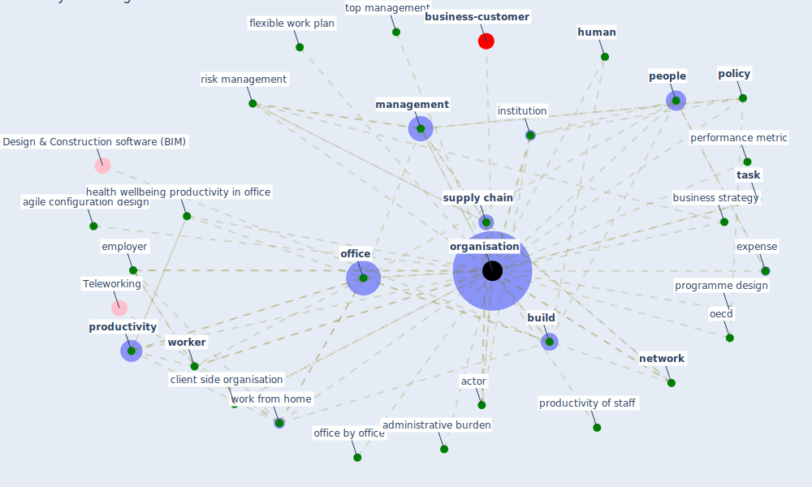

# Keyword: organisation

* [business-customer](cluster_11)

## Keywords

 * Cluster_11, actor, administrative burden, agile configuration design, amazon, apple, arbejdsmarke, [build](keyword_build), [building](keyword_building), [business](keyword_business), business activity, business case, business plan, business strategy, client side organisation, [community](keyword_community), complaint, corporation, cre strategy, culture, [datum](keyword_datum), deliver service, economic co operation and development oecd, [employee](keyword_employee), employee turnover, [employer](keyword_employer), erhverv, expense, facilitation, flexible work plan, geography, [government](keyword_government), health wellbeing productivity in office, [healthcare system](keyword_healthcare_system), [human](keyword_human), hvad det kommer til at betyde for virksomhedskulturen, individual, institution, intergovernmental, iot project, [management](keyword_management), [manager](keyword_manager), [network](keyword_network), non profit, nongovernmental, [oecd](keyword_oecd), [office](keyword_office), office building, office by office, [organisation](keyword_organisation), organisations, [people](keyword_people), performance, performance metric, [policy](keyword_policy), politik, [productivity](keyword_productivity), productivity of staff, programme design, risk management, [sector](keyword_sector), [service](keyword_service), service provision, [society](keyword_society), [space](keyword_space), staff turnover, [stakeholder](keyword_stakeholder), [supply chain](keyword_supply_chain), supply chain stakeholder, [survey](keyword_survey), [sweden](keyword_sweden), [task](keyword_task), top management, union, virksomhedskulturen, [virus](keyword_virus), waste energy, work atmosphere, work from home, [worker](keyword_worker), [workplace management](keyword_workplace_management), world health, [world health organization](keyword_world_health_organization)

## Mapping

## Neighbours

### Closest articles

* Health, Wellbeing \& Productivity in Offices - [LINK](article_world_green_building_council_health_2014)
* A study on office workplace modification during the COVID-19 pandemic in The Netherlands - [LINK](article_hou_study_2021)
* World Bank Development Report - [LINK](article_world_bank_world_2022)
* Urban planning after COVID-19 - [LINK](article_rtpi_urban_2021)
* Impact of COVID-19 on IoT Adoption in Healthcare, Smart Homes, Smart Buildings, Smart Cities, Transportation and Industrial IoT - [LINK](article_umair_impact_2021)
* Mapping research in logistics and supply chain management during COVID-19 pandemic - [LINK](article_montoya-torres_mapping_2021)
* Emerging from Lockdown: CIBSE COVID-19 Guidance - [LINK](article_cibse_emerging_2020)
* Guidelines for resilience systems analysis - [LINK](article_oecd_guidelines_2014)
* The Emergence of Anti-Privacy and Control at the Nexus between the Concepts of Safe City and Smart City - [LINK](article_allam_emergence_2019)
* Sustainable work throughout the life course: National policies and strategies, Publications Office of the European Union - [LINK](article_eurofund_sustainable_2016)

### Closest BPs

