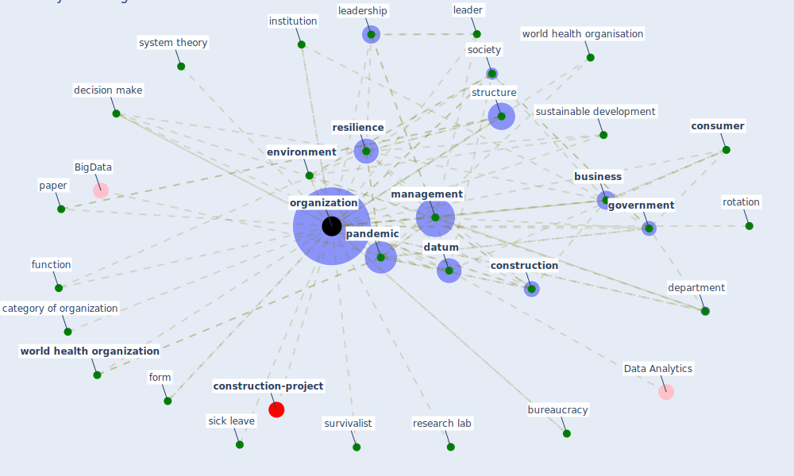

# Keyword: organization

* [construction-project](cluster_8)

## Keywords

 * Cluster_8, agile, agility factor, area of specialization, basic safety need, [big datum](keyword_big_datum), brewery, bureaucracy, [business](keyword_business), category of organization, [city](keyword_city), command andcontrol, [community](keyword_community), community based efforts, [construction](keyword_construction), construction stakeholder, [consumer](keyword_consumer), culture, [datum](keyword_datum), decision make, department, dynamic capability, economic behavior, [efficiency](keyword_efficiency), ehr affordance, ehr affordance actualization, enterprise, [entrepreneur](keyword_entrepreneur), [environment](keyword_environment), financial, food and agriculture, form, function, [government](keyword_government), group, [health club](keyword_health_club), in action, [industry](keyword_industry), industry good practice, infrastructure advisory council, institution, institutional, layout, layout of the house, leader, leadership, [learn](keyword_learn), legitimacy, living unit, [management](keyword_management), [manufacture](keyword_manufacture), maritime, [need](keyword_need), [network](keyword_network), notfor profit, [oecd](keyword_oecd), [organization](keyword_organization), organizations, [pandemic](keyword_pandemic), paper, performance, pictorially, research lab, research programme, [resilience](keyword_resilience), resilient, rotation, sick leave, [society](keyword_society), spatial, [stakeholder](keyword_stakeholder), [startup](keyword_startup), strategic goal, structure, support, survivalist, [sustainable development](keyword_sustainable_development), system theory, theory, [tourism](keyword_tourism), [unesco](keyword_unesco), [worker](keyword_worker), [workforce](keyword_workforce), world health organisation, [world health organization](keyword_world_health_organization)

## Mapping

## Neighbours

### Closest articles

* How COVID-19 Could Accelerate the Adoption of New Retail Technologies and Enhance the (E-)Servicescape - [LINK](article_willems_how_2021)
* Addressing vulnerability, building resilience: community-based adaptation to vector-borne diseases in the context of global change - [LINK](article_bardosh_addressing_2017)
* Architectural Design Drives the Biogeography of Indoor Bacterial Communities - [LINK](article_kembel_architectural_2014)
* Propositions for a Resilient, Post-COVID-19 Future for the AEC Industry - [LINK](article_nassereddine_propositions_2021)
* A Comprehensive Review of the COVID-19 Pandemic and the Role of IoT, Drones, AI, Blockchain, and 5G in Managing its Impact - [LINK](article_chamola_comprehensive_2020)
* COVID-19 as a Harbinger of Transforming Infrastructure Resilience - [LINK](article_carvalhaes_covid-19_2020)
* Pandemic Analytics: How Countries are Leveraging Big Data Analytics and Artificial Intelligence to Fight COVID-19? - [LINK](article_mehta_pandemic_2021)
* Guidelines for Responding to COVID-19 Pandemic: Best Practices, Impacts, and Future Research Directions - [LINK](article_assaad_guidelines_2021)
* Identifying Actions to Control and Mitigate the Effects of the COVID-19 Pandemic on Construction Organizations: Preliminary Findings - [LINK](article_raoufi_identifying_2021)
* Urban Community Sustainable Development Patterns under the Influence of COVID-19: A Case Study Based on the Non-Contact Interaction Perspective of Hangzhou City - [LINK](article_wang_urban_2021)

### Closest BPs

