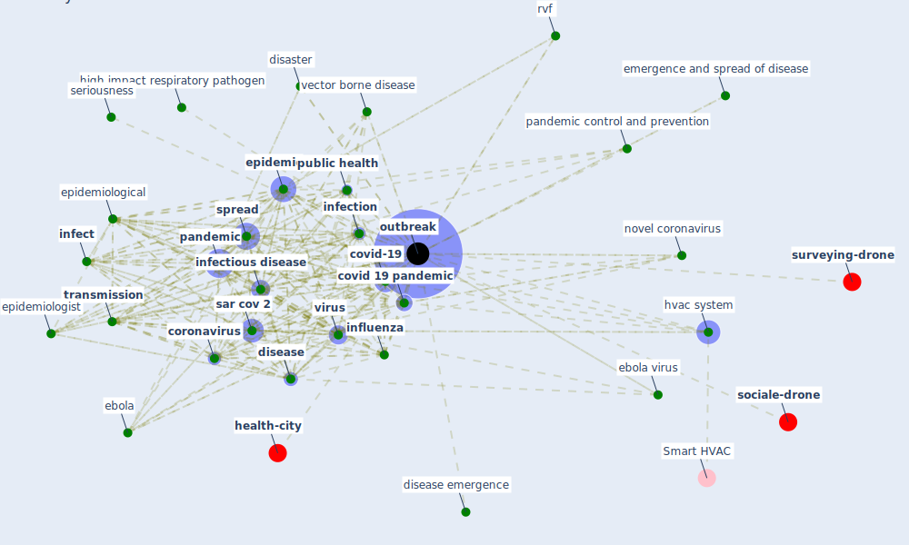

# Keyword: outbreak

* [health-city](cluster_1)

* [surveying-drone](cluster_6)

* [sociale-drone](cluster_13)

## Keywords

 * action can we take to prevent future outbreak, [coronavirus](keyword_coronavirus), coronavirus epidemic, countermeasure, covid 19 epidemic, covid 19 outbreak, [covid 19 pandemic](keyword_covid_19_pandemic), [covid-19](keyword_covid-19), current role of import case in chinese province, [detection](keyword_detection), diamond princess cruise ship, disaster, [disease](keyword_disease), disease emergence, disease growth, disease outbreak, dispersal, ebola, ebola virus, ecologically protective, emergence, emergence and spread of disease, emergency, [epidemic](keyword_epidemic), epidemic growth rate, epidemiologic, [epidemiological](keyword_epidemiological), epidemiologist, fragile situation, geographic location, hand hygiene, health security, high impact respiratory pathogen, human behavior, [hvac system](keyword_hvac_system), [index case](keyword_index_case), [infect](keyword_infect), [infection](keyword_infection), [infectious disease](keyword_infectious_disease), [influenza](keyword_influenza), large gathering, localize, mechanism of transmission, nationalism, next outbreak, novel coronavirus, online gaming, [outbreak](keyword_outbreak), [pandemic](keyword_pandemic), pandemic control and prevention, pneumonia, point prevalence survey, population reflux, potency, pre event preparation, prepare for outbreak, preparedness, previous case, previous year, prince of wale, prince of wale hospital, project region, [public health](keyword_public_health), public health system, [rift valley fever](keyword_rift_valley_fever), rvf, [sar cov 2](keyword_sar_cov_2), sar cov 2 pandemic, sar cov 2 virus, seasonal, second wave, seed, seriousness, severe acute respiratory syndrome coronavirus 2, source, [south korea](keyword_south_korea), [spread](keyword_spread), spread of the covid 19 pandemic, [symptom](keyword_symptom), syndromic, [taiwan](keyword_taiwan), the next outbreak, the outbreak, [transmission](keyword_transmission), transmission control, transmit denv, transmit denv locally, travel restriction, [tuberculosis](keyword_tuberculosis), unknown disease, [vector borne disease](keyword_vector_borne_disease), [ventilation](keyword_ventilation), [viral](keyword_viral), [virus](keyword_virus), virus spread, virus transmission, wave, west nile fever, widespread, wnv

## Mapping

## Neighbours

### Closest articles

* Understanding the role of urban design in disease spreading - [LINK](article_brizuela_understanding_2019)
* A Comprehensive Review of the COVID-19 Pandemic and the Role of IoT, Drones, AI, Blockchain, and 5G in Managing its Impact - [LINK](article_chamola_comprehensive_2020)
* On the Coronavirus (COVID-19) Outbreak and the Smart City Network: Universal Data Sharing Standards Coupled with Artificial Intelligence (AI) to Benefit Urban Health Monitoring and Management - [LINK](article_allam_coronavirus_2020)
* COVID-19 Prevention and Control Measures in Workplace Settings: A Rapid Review and Meta-Analysis - [LINK](article_ingram_covid-19_2021)
* Learning from pandemics: Applying resilience thinking to identify priorities for planning urban settlements - [LINK](article_syal_learning_2021)
* The impacts of knowledge, risk perception, emotion and information on citizens’ protective behaviors during the outbreak of COVID-19: a cross-sectional study in China - [LINK](article_ning_impacts_2020)
* A Global Survey of Infection Control and Mitigation Measures for Combating the Transmission of COVID-19 Pandemic in Buildings Under Facilities Management Services - [LINK](article_sarvari_global_2022)
* Rotating groups at work, school best against COVID-19 spread: Study - [LINK](article_afp_rotating_2021)
* Supporting Technologies for COVID-19 Prevention: Systemized Review - [LINK](article_zhao_supporting_2022)
* Mobile Technology Solution for COVID-19: Surveillance and Prevention - [LINK](article_raza_mobile_2021)

### Closest BPs

